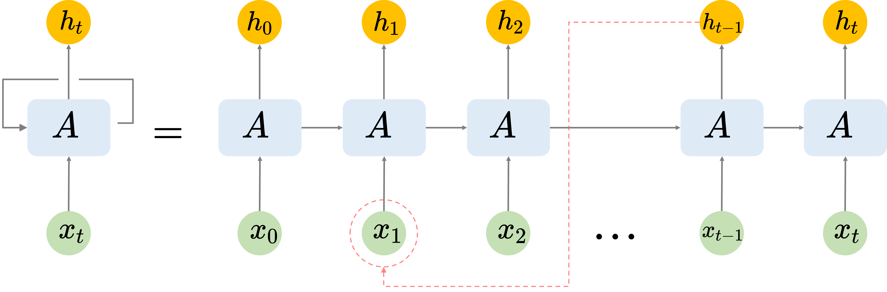

### 2.1.1 循环神经网络与长期依赖问题

循环神经网络（Recurrent Neural Networks，RNN）[23]是一类具有记忆能力的人工神经网络，其具有按时间维度展开的递归结构，如图 2.1.1.1 所示。这使得 RNN 具有存储历史记忆的能力使其可以用于学习时间序列类问题。

<label>图 2.1.1.1 循环神经网络结构</label>

然而随着输入时间序列变长会引发梯度消失现象，表现上看 RNN 会丢失距离当前时刻较远的历史信息，进而影响预测准确率。如图 2.1.1.1 中虚线部分所示，假设 $t-1$ 时刻输出需要借助较早时刻捕捉的信息，即具有长期依赖关系（深度学习领域普遍存在）[26-27]，则传统的 RNN 无法解决此类问题，即所谓的长期依赖问题。