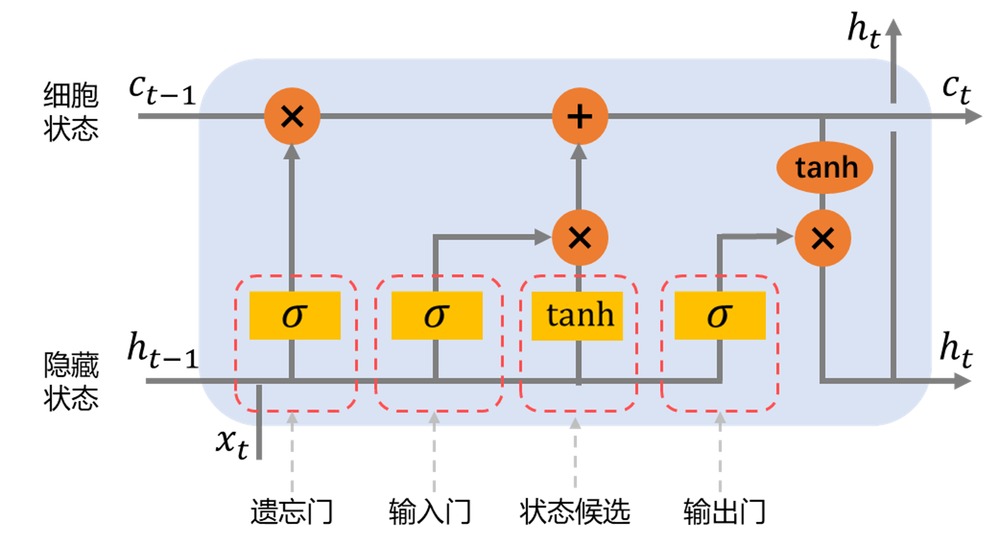

### 2.1.2 LSTM 神经网络结构

为解决长期依赖问题，长短期记忆神经网络被设计出来，其主要基于增加内部的细胞状态以及设计门控机制来建立较长的长距离时序依赖关系。本质上 LSTM 是一种特殊的 RNN，区别在于循环的每个基本单元的结构不同，图 2.1.2.1 给出了基本的 LSTM 单元结构。

<label>图 2.1.2.1 LSTM 单元结构</label>

其基本原理是新增一个用于保存长期记忆的细胞状态（cell state），细胞状态在每一个时刻只进行一些次要的线性操作从而使历史信息得以很好地保留下去。另一方面，新增的门控机制起到调节细胞状态的功能，包括信息的添加与删除等[33]。

具体而言，在 LSTM 前向传播过程中会经历以下环节：

（1）遗忘门

遗忘门（forget gate）是 LSTM 门控机制之一，负责遗忘细胞状态中旧有的信息。其计算过程为：

$$f_t = \sigma(W_f \cdot [h_{t-1},x_t] + b_f)$$

遗忘门输出结果被 sigmoid 函数映射至 $0$ 到 $1$ 之间实数组成的实数向量，通过乘以上一时刻的细胞状态（代表长期记忆）：$f_t \times c_{t-1}$ 来调节长期记忆，例如输出数值为 $0$ 意味着完全遗忘，输出 $1$ 意味着完全保留。

（2）输入门与状态候选

输入门（input gate）也是 LSTM 门控机制之一，负责确定新的信息保存在细胞状态中的比重，其计算过程如下：

$$i_t = \sigma(W_i \cdot [h_{t-1},x_t] + b_i)$$

类似于遗忘门，其输出也为 $0$ 到 $1$ 之间实数组成的实数向量，代表的是新的候选记忆将以多大比重保留到长期记忆中。

状态候选环节与输入门配合使用，即负责生成上述候选记忆。其基于一个 $\tanh$ 层从当前时刻输入信息 $x_t$ 与短期记忆（即上一时刻隐藏状态 $h_{t-1}$）中生成当前时刻的候选细胞状态 $\tilde{c_t}$：

$$\tilde{c_t} = \tanh(W_c \cdot [h_{t-1},x_t] + b_c)$$

状态候选环节给出了当前时刻的候选细胞状态 $\tilde{c_t}$，输入门确定了候选状态中保留到长期记忆的比重，则 $i_t \times \tilde{c_t}$ 即新添加到细胞状态中的信息。包括遗忘与新信息添加在内的完整细胞状态更新如下：

$$c_t = f_t \times c_{t-1} + i_t \times \tilde{c_t}$$

（3）输出门

输出门（output gate）是负责调节最终隐藏状态输出比重的门控环节，用以辅助隐藏状态更新。类似上述两个门控，其计算过程为：

$$o_t = \sigma(W_o \cdot [h_{t-1},x_t] + b_o)$$

而当前时刻输出的隐藏状态 $h_t$ 是基于当前时刻的细胞状态（更新完成后）经 $tanh$ 层处理后由输出门结果 $o_t$ 进行调整而得：

$$h_t = o_t \times \tanh(c_t)$$

由于隐藏状态相当于短期记忆信息，此环节即从当前长期记忆中再抽取信息作为当前最新的短期记忆。

最后，包含当前时刻长期记忆的细胞状态 $c_t$ 与包含当前时刻短期记忆的隐藏状态 $h_t$ 会一同传递到下一时刻。