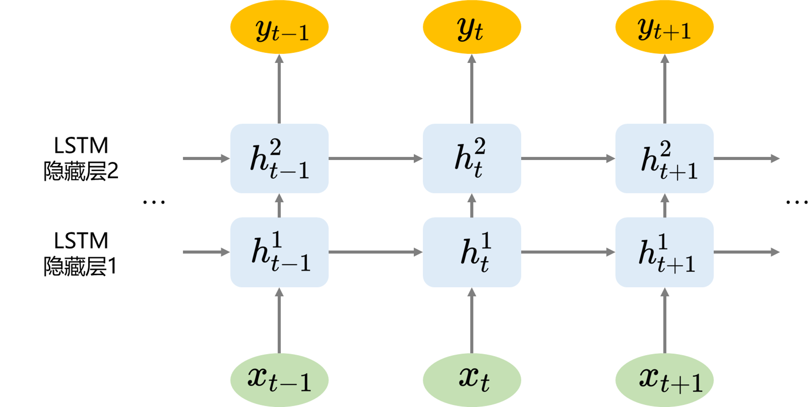

### 2.1.3 堆叠式 LSTM 架构

对于 RNN 而言，可以通过将 RNN 堆叠以加深神经网络的深度，额外的隐藏层可以重新组合先前层的学习表示从而有望在高抽象级别创建新的表示，进而更好地帮助完成预测等任务。

LSTM 作为一种特殊的 RNN，同样也可以通过堆叠来从空间的深度中受益，一般的堆叠式 LSTM 架构如图 2.1.3.1 所示，大体上看堆叠式 LSTM 架构可以定义为由多个 LSTM 层组成的 LSTM 模型，实现上是将前一个 LSTM 隐藏层的输出重新输入至另一个 LSTM 网络进行再训练。堆叠式 LSTM 架构也被广泛应用于时序预测问题，并有稳定较好的表现。

<label>图 2.1.3.1 堆叠式 LSTM 架构</label>

