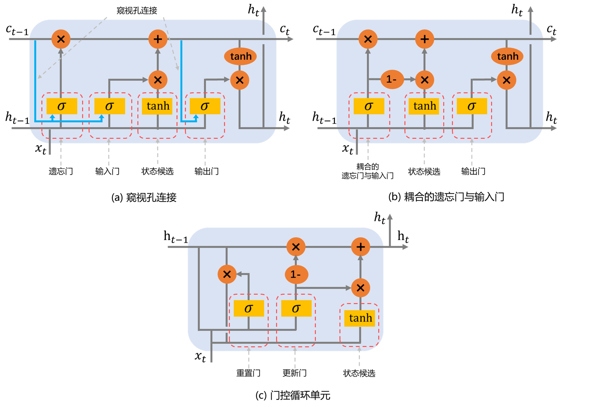

### 2.1.4 LSTM 神经网络变体

LSTM 已被广泛研究，不同研究者从不同角度优化 LSTM 模型提出了不同的 LSTM 变体[33-36]，本节简要介绍几种变体方案。

<label>图 2.1.4.1 LSTM 变体模型</label>

（1）窥视孔连接

一种简单的变体是为 LSTM 增加窥视孔连接（peephole connection），如图 2.1.4.1（a）所示，其思路是让 LSTM 在门控环节不仅考虑当前输入与上一时刻的隐藏状态，还额外考虑相应的细胞状态。即：

$$
\begin{align*}
  f_i &= \sigma(W_f \cdot [\mathbf{c_{t-1}},h_{t-1},x_t] + b_f) \\
  i_i &= \sigma(W_i \cdot [\mathbf{c_{t-1}},h_{t-1},x_t] + b_i) \\
  o_t &= \sigma(W_o \cdot [\mathbf{c_{t}},h_{t-1},x_t] + b_o)
\end{align*}
$$

上述为所有三个门增加了窥视孔连接，实际情况可以选择仅为个别门增加。

（2）耦合的输入门与输出门

从原理上，遗忘门决定遗忘（相当于削减）部分长期记忆的比重，输入门决定输入新的长期记忆的比重，二者相对互补，具有一定的冗余性。为此一种变体考虑将二者结合，使用一个耦合的输入门与输出门（Coupled Input and Forget Gate，CIFG）来允许 LSTM 同时决定遗忘与添加信息的比重，如图 2.1.4.1（b）所示。此时单元状态更新过程为：

$$c_t = f_t \times c_{t-1} + \mathbf{(1-f_t)} \times \tilde{c_t}$$

相当于去掉了输入门，并利用遗忘门输出的补来决定输入比重。

（3）门控循环单元

门控循环单元（Gated Recurrent Unit，GRU）[36]较上述两者而言变化更加显著，其进一步简化了 LSTM 单元的结构（如图 2.1.4.1（c）所示），包括合并了细胞状态与隐藏状态，以及同样基于避免冗余的原因，将输入门与遗忘门合并成更新门（update gate），来控制遗忘旧信息与保留新候选信息的比重。GRU 使用另一个新门重置门（reset gate）来决定当前时刻的候选状态需要依赖先前状态的比例，从而影响新的输入记忆与先前记忆结合的过程。其计算过程如下：

$$
\begin{align*}
 u_t & = \sigma(W_u \cdot [h_{t-1},x_t]) \\
  r_t & = \sigma(W_r \cdot [h_{t-1}, x_t]) \\
  \tilde{h_t} & = \tanh(W \cdot [r_t \times h_{t-1}, x_t]) \\
  h_t & = (1 - u_t) \times h_{t-1} + u_t \times  \tilde{h_t}
\end{align*}
$$

由于合并了状态以及减少了门控数量，大体上看 GRU 相比 LSTM 有更少的带训练参数，具有更好的训练速度，同时 GRU 同样保留了 LSTM 能解决长期依赖问题等的优势。