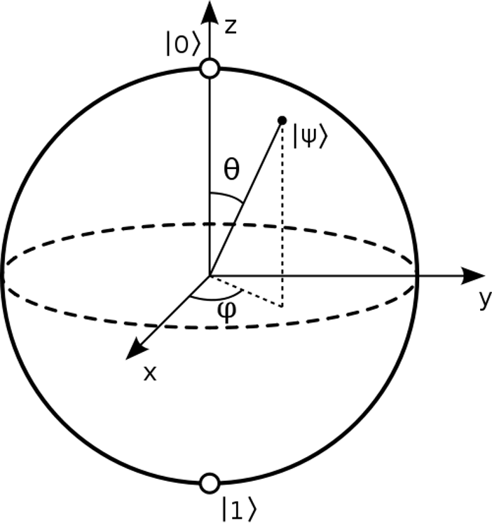

### 2.2.1 量子态

根据量子力学第一假设，孤立量子系统的状态空间可使用复内积向量空间，即希尔伯特（Hilbert）空间来表示。系统完全由状态空间里的一个单位向量来描述。

量子比特（quantum bit，qubit）将比特的概念量子化，作为最简单的量子系统，其状态空间由二维希尔伯特空间描述，具体而言量子比特的状态可以通过单位向量 $|\psi\rangle = \alpha|0\rangle + \beta|1\rangle$ 来描述，其中 $\alpha, \beta \in \mathbb{C}$ （称为概率振幅）且 $|\alpha|^2 + |\beta|^2=1$。其中 $|0\rangle$ 与 $|1\rangle$ 为 $\mathcal{H}_2$ 的一组标准正交基，表示为：

$$
|0\rangle = \begin{bmatrix}
 1\\0
\end{bmatrix}, \ \ 
|1\rangle = \begin{bmatrix}
 0\\1
\end{bmatrix}
$$

量子比特是 $|0\rangle$ 态与 $|1\rangle$ 态的线性组合，这一特性称为叠加态（superposition）。此外，一般还可以将量子比特状态改写为 $|\psi\rangle = \cos \frac{\theta}{2}|0\rangle + e^{i\varphi}\sin\frac{\theta}{2}|1\rangle$ 的有效形式，其中 $\theta$ 与 $\varphi$ 定义了三维单位球面上的一个点，如图 2.2.2.1 所示，称为量子比特的 Bloch 球面表示。

<label>图 2.2.2.1 量子比特的 Bloch 球面表示</label>

有时不清楚系统具体所处的态，但知道系统状态由若干纯态（pure state） $|\psi_i\rangle$ 与相应的概率 $p_i$ 组成，混合态（mixed state）可以使用密度算子（density operator）来描述：

$$
\rho \equiv \sum_i p_i |\psi_i\rangle\langle\psi_i|
$$

其中 $|\psi_i\rangle\langle\psi_i|$ 为向量 $|\psi_i\rangle$ 的外积。特别地，对纯态 $|\psi\rangle = \alpha|0\rangle + \beta|1\rangle$ 而言，其密度算子为 $\rho=|\psi\rangle\langle\psi|=\alpha|0\rangle\langle0|  + \beta|1\rangle\langle1|$，对应的密度矩阵为：

$$
\begin{bmatrix}
 \alpha & 0\\
  0 & \beta
\end{bmatrix}
$$

换言之，密度算子提供了状态向量之外的描述量子系统的另一种表示方式。