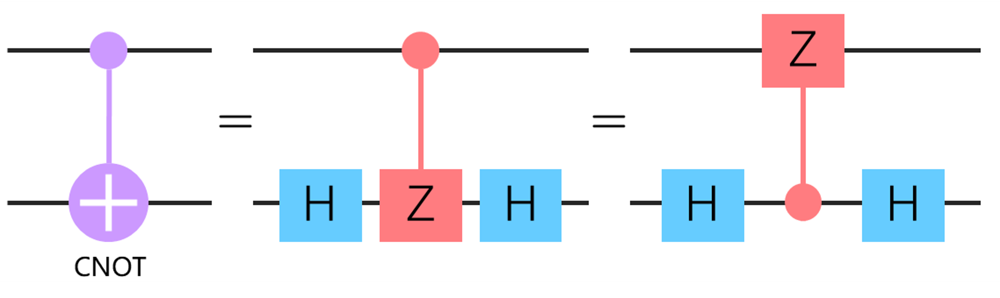

### 2.2.3 酉变换与量子门

根据量子力学第二假设，封闭量子系统的状态演化由酉变换刻画，与一个酉算子（unitary operator）相关联：

$$|\psi'\rangle = U|\psi\rangle$$

对于密度算子表示而言为：

$$\rho' = U\rho U^\dagger$$

其中酉算子是满足 $U^\dagger U=UU^\dagger =I$（$U^\dagger$ 为 $U$ 的伴随算子）的复数矩阵。

量子计算机由连线与被称为量子门（quantum gate）的酉变换排列而成。量子门描述了对量子态的操作，根据操作的量子比特的数量可将量子门分为单量子比特门与多量子比特门。具体而言，考虑 $U$ 为 $2^n\times 2^n$ 的酉矩阵，$\bar{q} = q_1,\cdots,q_n$ 为一组量子比特序列（常称为量子寄存器），则 $G\equiv U[\bar{q}]$ 称为 n-量子比特门[90]。

常用的单量子比特门包括：

（1）泡利矩阵

$$
\sigma_x = X = \begin{bmatrix}
 0 & 1 \\
 1 & 0
\end{bmatrix}, \ \
\sigma_y = Y = \begin{bmatrix}
 0 & -1 \\
 1 & 0
\end{bmatrix}, \ \ 
\sigma_z = Z = \begin{bmatrix}
 1 & 0 \\
 0 & -1
\end{bmatrix}
$$

（2）Hadamard 门（H 门）

$$
H = \frac{1}{\sqrt{2}} \begin{bmatrix}
 1 & 1 \\
 1 & -1
\end{bmatrix}
$$

H 门被广泛应用于制备叠加态：$H|0\rangle = 1/\sqrt{2}(|0\rangle + |1\rangle)$。

（3）旋转门

$R_x$、$R_y$ 与 $R_z$ 门是具有一个参数（表示旋转角度）的带参量子门，分别表示 Bloch 球体上的量子态关于 $x$ 轴、$y$ 轴与 $z$ 轴的旋转：

$$
R_x(\theta) = \begin{bmatrix}
 \cos\frac{\theta}{2} & -i\sin\frac{\theta}{2}  \\
 -i\sin\frac{\theta}{2} & \cos\frac{\theta}{2} 
\end{bmatrix}, \ \ 

R_y(\theta) = \begin{bmatrix}
 \cos\frac{\theta}{2} & -\sin\frac{\theta}{2}  \\
 \sin\frac{\theta}{2} & \cos\frac{\theta}{2} 
\end{bmatrix}, \\ 

R_z(\theta) = \begin{bmatrix}
 e^{-i\theta/2} & 0  \\
 0 & e^{i\theta/2}
\end{bmatrix}
$$

另一组通用的旋转门是 $U_1$、$U_2$ 与 $U_3$ 门。分别具有 1、2、3 个与旋转角度相关的参数：

$$
U_1(\lambda) = \begin{bmatrix}
 1 & 0 \\
 0 & e^{i\lambda}
\end{bmatrix}, \ \ U_1(\lambda) = e^{i\lambda/2} R_z(\lambda)
$$

$$
U_2(\phi,\lambda) = \frac{1}{\sqrt{2}} \begin{bmatrix}
 1 & -e^{i\lambda} \\
 e^{i\phi} & e^{i(\phi+\lambda)}
\end{bmatrix}, \ \ U_2(\phi,\lambda) = e^{i(\phi+\lambda)/2}R_z(\phi)R_y(\frac{\pi}{2}) 
$$

$$
U_3(\theta,\phi,\lambda) = \begin{bmatrix}
 \cos(\frac{\theta}{2}) & -e^{i\lambda}\sin(\frac{\theta}{2}) \\
 e^{i\phi}\sin(\frac{\theta}{2}) & e^{i(\phi+\lambda)}\cos(\frac{\theta}{2})
\end{bmatrix}, \\ U_3(\theta,\phi,\lambda) = R_z(\phi)R_x(-\pi/2)R_z(\theta)R_x(\pi/2)R_z(\lambda)
$$

多量子比特门常用来制备纠缠态等，常用的有双量子比特门 CNOT 门（受控非门）：

$$
CNOT = \begin{bmatrix}
 1 & 0 & 0 & 0 \\
 0 & 1 & 0 & 0 \\
 0 & 0 & 0 & 1 \\
 0 & 0 & 1 & 0
\end{bmatrix}
$$

其效果为 $CNOT|i_1, i_2\rangle = |i_1, i_1 \oplus i_2\rangle$。此外 CNOT 门实际上可以分解为 H 门和 CZ 门（受控 Z 门）的组合，如图 2.2.3.1 所示。CZ 门的定义如下：

$$
CZ = \begin{bmatrix}
 1 & 0 & 0 & 0 \\
 0 & 1 & 0 & 0 \\
 0 & 0 & 1 & 0 \\
 0 & 0 & 0 & -1
\end{bmatrix}
$$

CZ 门同样可以制备纠缠关系，不同于 CNOT 门的是，在 CZ 门中两个量子比特的地位是相同的（如图 2.2.3.1 所示），意味着 CZ 门的操作较之 CNOT 门相对更简单些，且在真实物理设备上的确较之 CNOT 门更易实现。

<label>图 2.2.3.1 CNOT 门分解</label>

通常若基于一组量子门集合 $\{G_i\}$ 的任意组合可以以任意精度近似逼近任意酉算子，则称这一组量子门集合为通用量子门集合（universal quantum gate set）。上述的单比特旋转门与双比特门 CNOT 或 CZ 均可组成一组通用量子门集合。