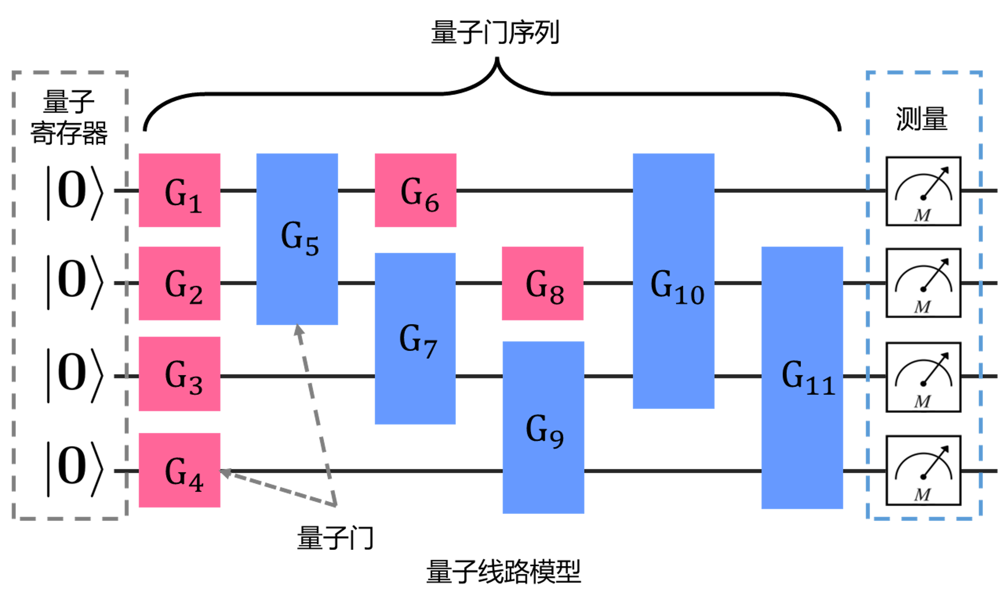

### 2.2.5 量子线路

量子线路（Quantum Circuit）模型是数字电路的量子对应物，作为量子计算的基本模型为描述量子算法等提供了通用语言。其由量子比特、线路（时间线）以及量子门序列构成如图 2.2.5.1 所示。其中量子比特的序列常称为量子寄存器。

<label>图 2.2.5.1 量子线路模型</label>

形式化而言，量子线路可定义为量子门构成的序列：$C\equiv G_1,\cdots,G_m$ 其中 $G_i$ 为量子门，满足 $G_i\equiv U_i[\bar{r_i}]$，$\bar{r_i}$ 为量子门 $G_i$ 作用的量子比特序列。定义 $qvar(G)$ 为量子门 $G$ 的目标量子比特结合，则线路操作的量子比特变量集合为 $qvar(C)= \bigcup_{i=1}^{m}qvar(G_i)$。对于线路总体的输入状态 $|\psi\rangle \in \mathcal{H}_{qvar(C)}$，则输出结果为 $C|\psi\rangle = \overline{U}_m \cdots \overline{U}_1 |\psi\rangle$。其中 $\overline{U}_i$ 是 $U_i$ 借由单位算子 $I$ 从子空间 $\mathcal{H}_{qvar(G_i)}$ 扩张到 $\mathcal{H}_{qvar(C)}$ 的结果[90]。