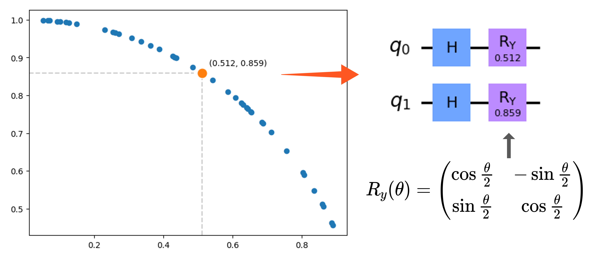
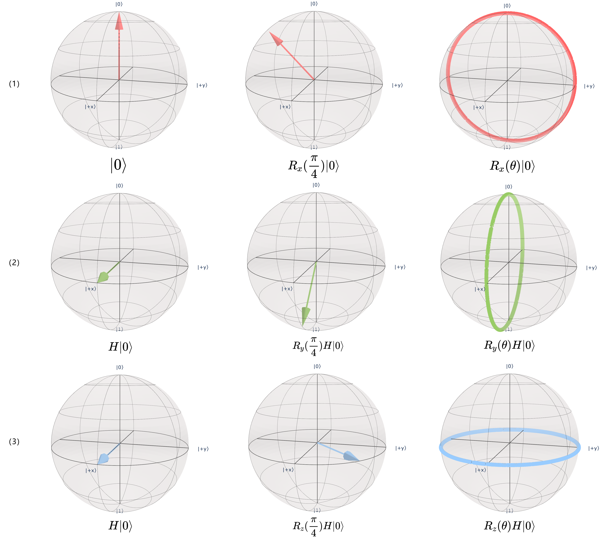

### 2.3.1 编码层

对 QNN 而言，其处理的输入数据为量子态，换言之未经处理的经典数据是无法直接应用于 QNN 的输入，解决的办法是采用一定的编码方案将经典数据编码至量子态。编码层（图 2.3.1（a））就起到了上述作用，可以将编码层的作用视为一个将经典数据 $x \in \mathbb{R}^{S_{in}}$ 映射至 $S$ 量子比特的希尔伯特空间的一个特征映射 $\mathcal{U}_x$[80]，但具体的映射方案还是与采用的编码方案有关。以下列举典型的几类量子编码方案[81]。

（1）基态编码

基态编码（Basic Encoding）是最为直观的一种量子编码方式。其将一个长度为 $n$ 的二进制字符串 $x$ 转化为一个具有 $n$ 个量子比特的量子态 $|x \rangle = |i_x \rangle$，其中 $|i_x \rangle$ 为一个计算基态。例如，基于基态编码可以将经典数据 $x = 1101$ 编码为量子态 $|1101\rangle$。

基态编码方案简单直观，直接对应了 Schuld 等[60]所给出的 QNN 的前提条件之一：系统的初始状态可以编码任意长度的二进制字符串。但对于一些数据场景，其缺点也十分明显。考虑一条具有 $D$ 维度特征的样本数据，且每个特征编码为长 $P$ 的二进制字符串（此时 $P$ 与编码的精度有关），则该条样本数据需由 $D\times P$ 个量子比特进行编码。这在可用量子比特位数相当受限的当前情况来看，基于基态编码处理多特征数据的可行性不大。

（2）振幅编码

振幅编码（Amplitude Encoding）可以将一个长为 $N$ 的经典数据向量 $\overrightarrow{x} = (x_1, x_2, ..., x_N)^T$ 编码至一个有 $n = \left \lceil \log_{2}{N}  \right \rceil$ 个量子比特的量子态，具体而言有：$|\overrightarrow{x} \rangle = \sum_{i}^{N}x_i|i\rangle$，其中 $\{|i\rangle\}$ 构成希尔伯特空间的一组基。从而经典数据 $x_i$ 充当了量子态的概率振幅。由量子力学第一假设的约束，$|\overrightarrow{x} \rangle$ 为希尔伯特空间的单位向量，进而需要满足归一化条件：$\sum_{i}^{N}x_i^2=1$。例如，基于振幅编码可以将经典向量 $(\frac{1}{2} , -\frac{1}{2} , \frac{1}{2} , -\frac{1}{2} )^T$ 编码至量子态 $\frac{1}{2} |00\rangle - \frac{1}{2} |01\rangle + \frac{1}{2} |10\rangle - \frac{1}{2} |11\rangle$。

对于基态编码中讨论的例子而言，基于振幅编码只需要 $\left \lceil \log_{2}{D}  \right \rceil$ 个量子比特，这样的编码效率无疑是振幅编码最大的优点。然而振幅编码无法用简单的量子线路形式加以表示，往往会加深编码层，进而导致时间复杂度较高，同时其需要相关的高效制备任意态的技术来辅助振幅编码。

（3）角度编码

角度编码（Angle Encoding）使用了旋转门来编码经典信息 $\overrightarrow{x} = (x_1, x_2, ..., x_N)^T$，通过将经典数据作为旋转门的参数（表示旋转角度）可以自然的将之编码为 $|\overrightarrow{x}\rangle = \bigotimes _i^nR(x_i)|0^n\rangle$，其中的 $R$ 可以是围绕不同轴进行旋转的 $R_x$、$R_y$ 或者 $R_z$。图 2.3.1.1 给出了一个角度编码的示例，其中在编码前使用 Hadamard 门制备叠加的初始态是量子算法中常见的预处理。

<label>图 2.3.1.1 角度编码示例</label>

图 2.3.1.2 分别展示了基于 $R_x$、$R_y$ 以及 $R_z$ 旋转门进行角度编码的可视化结果。第一列为系统的初态（除使用 $R_x$ 外均制备叠加初始态），第二列为在不同轴向上旋转 $45^{\circ}$ 后的结果，可以直观感受到不同旋转门的使用效果。第三列为对旋转角度随机采样 1000 次后量子态的分布情况。可见使用不同旋转门均能将数据投影到一个连续空间上。同时可见由于三角函数的周期性，不同数据有可能被旋转门投影到同一量子态，故而为更好地区分不同数据，在使用角度编码前最好对经典数据进行必要的缩放（标准化或归一化）等预处理操作。

<label>图 2.3.1.2 不同旋转门的角度编码可视化</label>

显然基于此种编码方案，长为 $N$ 的经典数据会被编码至 $N$ 个量子比特。但这一数量可以经由密集角度编码的改良方案下降到 $N/2$[82]。大体上角度编码所需的量子比特数量较之基态编码处在相对更可接受的范围内，此外较之振幅编码而言基于角度编码的编码层有常数级的深度，同时编码方式更为简便，因而角度编码成了 NISQ 时代较为常用与适合的量子编码方案之一[82]。