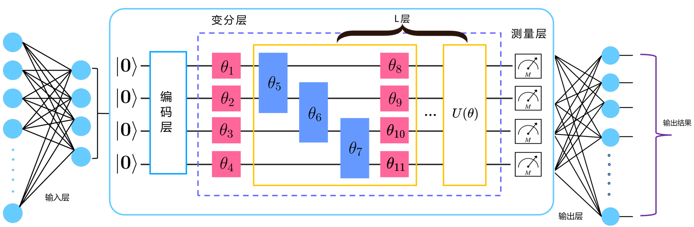

### 2.3.5 混合量子-经典架构

本质上基于 VQC 的 QNN 依旧需要在经典计算机上完成参数优化等辅助任务，因此 QNN 本身就可以看做是一个混合量子-经典算法。此处介绍的混合量子-经典架构是指 QNN 与经典神经网络配合共同组成一个神经网络层的架构方案，如图 2.3.5.1 所示。

<label>图 2.3.5.1 混合量子-经典神经网络架构</label>

注意到在 NISQ 时代，可用的量子比特数目十分有限。即使在经典计算机上，大数目的量子比特系统的模拟也十分困难。考虑输入的经典数据为 $\overrightarrow{x} = (x_1, x_2, ..., x_D)$ 的情况，基于普通的角度编码会编码至 $D$ 个量子比特系统，但在 $D$ 较大的情况下显然难以在量子计算机上实现。一种改进方式是改良量子编码方案，例如使用高效的振幅编码等，但同时会加大编码实现难度，加深线路深度等[81]。

另一种 NISQ 时代可以采用的方案是在进行量子编码前进行必要的数据降维，一种典型的降维方案是采用经典的全连接层（Fully Connected Layer）将高维的输入矢量转为低维矢量表示[78]。例如对上述案例，在 QNN 前使用全连接层预处理经典数据可将 $D$ 维的原始输入转为匹配可用量子比特数目的 $d$ 维输入数据 $\overrightarrow{x'} = (x_1', x_2', ..., x_d')$。对称的，如有必要可以基于另一全连接层将 QNN 输出结果 $\overrightarrow{x''} = (x_1'', x_2'', ..., x_d'')$ 转为具有必要输出维度的输出数据 $\overrightarrow{x_{out}} = (x_{out,1}, x_{out,2}, ..., x_{out,D_{out}})$ 作为最终输出结果。上图描述了这一过程，最终 QNN 与输入输出层（由独立的全连接层充当）共同构成了一个混合量子-经典神经网络层，并共同参与训练。称这种架构方式为混合量子-经典神经网络架构。

此种架构的特点是较简单的解决了数据维度匹配问题，避免使用大数目的量子比特以及避免了对量子线路的进一步影响，但缺点在于引入的全连接层会大幅增加所需训练的参数数量。可视为 NISQ 时代下处理该问题的一种折中方案。