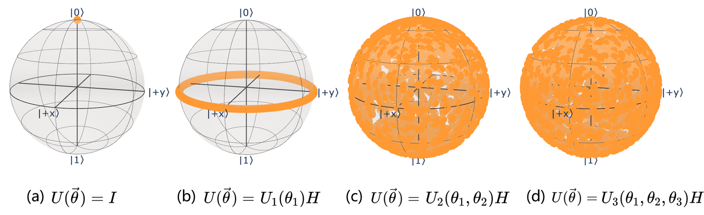

### 2.3.6 评价指标

变分量子线路的结构，即所谓的拟设的设计具有一定的灵活性，为此如何设计或选择合适的拟设以更好地提升 QNN 性能就成了构造 QNN 过程中不得不考虑的因素之一。Sim 等人[84]从线路的表达能力、纠缠能力等角度提出了用以评价了混合量子-经典算法中 VQC 的相关指标，为挑选或评价 VQC 结构提供了可行的方法。以下简要讨论相关的指标。

（1）可表达性

大体上量子线路的可表达性（Expressibility）反映了线路生成状态的能力。直观来看相当于为线路取遍所有可能取值时线路所能表达的量子态范围的大小[86]。对单比特线路而言，可表达性即反映了线路生成的量子态覆盖 Bloch 球表面的范围情况。图 2.3.6.1 展示了四种单比特线路基于 Bloch 球的可表达性可视化情况，其中每个带参数线路案例均对参数进行 2000 次采样。无疑四例中 $I$ 门对应的可表达性最差。随着使用的通用旋转门 $U_d$ 的参数数量增加，相应的可表达性也增强。

<label>图 2.3.6.1 单比特线路可表达性可视化示例（基于 Bloch 球）</label>

然而上述的分析很难定量的给出可表达性的大小，对于分析多量子比特系统更是无力，为此 Sim 等提出可以经由比较目标变分量子线路生成的状态分布与原始空间随机状态分布（即 Haar 随机状态集合构成的分布）间的距离来衡量线路的可表达性。换言之该方法从某种程度上刻画了待测 VQC 所能生成的量子态占量子态空间的比例。

具体而言，该方法拟使用任意两个量子态间保真度的概率分布，即计算 VQC 生成的任意一对量子态的保真度概率分布 $P_{VQC}(F)$ 与 Haar 随机状态集中任意一对量子态的保真度概率分布 $P_{Haar}(F)$ 间的距离来刻画可表达性。可以使用 Kullback-Leibler (KL) 散度计算两分布间的距离，得到可表达性度量：

$$Expr = D_{KL}(P_{VQC}(F) \parallel P_{Haar}(F))$$

实际情况下在多量子比特空间下难以求得实际的 $P_{VQC}(F)$，但可以通过多次独立重复采样参数矢量对以获取量子态样本对，并估计出生成量子态的保真度分布 $\hat{P}_{VQC}(F; \overrightarrow{\theta})$。对于 $P_{Haar}(F)$ 而言其具有解析表示：$P_{Haar}(F) = (d-1)(1 - F)^{d-2}$，其中 $d$ 表示系统希尔伯特空间的维度。由于采样数有限，最终使用的均是离散化后的概率分布，则基于概率分布估计的可表达性计算公式为：

$$Expr = D_{KL}(\hat{P}_{VQC}(F; \overrightarrow{\theta}) \parallel P_{Haar}(F))$$

就结果而言，KL 散度值越小，表明对应 VQC 的表达能力越强。本研究中采用 Hubregtsen 等[87]微调后的可表达性定义：

$$Expr' = -\log_{10}(D_{KL}(\hat{P}_{VQC}(F; \overrightarrow{\theta}) \parallel P_{Haar}(F)))$$

基于此可表达性定义，有 $Expr'$ 值越大，VQC 的表达能力越强。后文中的 $Expr$ 指标均指代此处的 $Expr'$。对于图 2.3.6.1 中所示的案例，基于上述可表达性公式进行模拟计算（在 $Qiskit$ 上实现），可表达性结果以及采样的保真度分布结果等如图 2.3.6.2 所示（同样取 2000 次采样结果）。其中 $Expr$ 值越大表明可表达性能力越强，结果如前述分析的一致。

<label>图 2.3.6.2 单比特线路可表达性可视化示例（基于保真度分布表示）</label>

（2）纠缠能力

量子纠缠早已被证明是量子算法中的重要资源，对于 QNN 算法而言，已有的证据表明线路中的纠缠能力有助于捕获数据中的非平凡相关性，提升 QNN 对特定问题解空间的表示能力[79]。故而纠缠能力（Entanglement Capability）也是评价线路拟设的重要指标之一。

Sim 等[84]基于平均 Meyer–Wallach（MW）度量设计了 VQC 的纠缠能力指标。 MW 度量是评价纯态纠缠能力的指标之一，基于 Brennen 形式可以表示为[88]：

$$Q(|\psi\rangle) = \frac{1}{n}\sum_{k=1}^{n}2(1 - Tr[\rho _k^2])$$

其中 $|\psi\rangle$ 表示系统的输出量子态，$\rho_k$ 对应系统中第 $k$ 个量子比特对应的约化密度矩阵，且有 $0\le  Q \le 1$。对于无纠缠的系统将输出 $0$，例如 $Q(|01\rangle)=0$；对于最大纠缠态则输出 $1$，例如 $Q(\frac{1}{2}(|00\rangle + |11\rangle))=1$。故 $Q$ 值越大反映了线路的纠缠能力越强。

对于评价 VQC 的纠缠能力，同样可以基于采样的方式计算线路在采样的参数向量集 $S$ 上的平均 MW 度量来估计：

$$Ent = \frac{1}{\left | S \right | }\sum_{\overrightarrow{\theta}_i \in S}Q(|\psi_{\overrightarrow{\theta}_i}\rangle)$$

（3）成本指标

通常情况下还会考虑量子线路的构造成本，特别是 NISQ 时代过于复杂的量子线路除了构造时间外还会导致程序整体的相干时间减少、噪声发生率增加，导致程序只能以较低保真度运行。常用的一些线路相关的成本指标包括门数量、双量子比特门数量、线路深度以及参数数量等[84]。

最简明的成本指标是门数量，即描述构造指定量子线路所需的各类量子门总数。双量子比特门的构造成本一般远高于单量子比特门[89]，且同时在量子算法中起到制备纠缠能力的重要作用，因此单独计算双量子比特门数也是常用的量子线路成本指标之一。

此外，量子门在物理设备上实现需要各自所需时间，在此基础上线路的拓扑结构决定了量子门间执行的先后顺序与是否可以并行执行等进而影响总体的执行时间，一般用深度来刻画量子线路执行的最小时间步长。换言之量子线路的深度表示顺着指定的量子门拓扑结构从输入到输出所需的最小时间，大致反应了量子计算机执行线路的所需时间，同时过深的量子线路在 NISQ 也面临高噪声弱相干等问题，因此线路深度也反映了线路的构造与实现难度。

最后，参数数量与变分量子线路尤其相关，变分量子算法经由经典计算机的优化例程更新参数，因此参数数量可以作为反应带参数量子线路的优化难度的粗略估量。