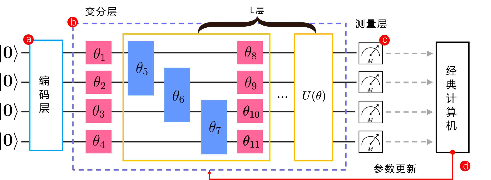

## 2.3 量子神经网络

本节主要对本研究中使用的量子神经网络（QNN）相关的技术作简要介绍。如 1.2.2 节所述，不同研究者基于对 QNN 的不同定义，依据不同架构设计出了多种类型的 QNN[61]。但现阶段基于变分量子线路（VQC）构建 QNN 的方法作为较主流的方法之一，已得到了广泛的研究[52，63]。因此本节主要讨论的是基于 VQC 构建 QNN 的方法以及相关细节。

变分量子线路（VQC）也叫参数化量子线路，顾名思义其是一种具有自由参数的量子门线路，已广泛应用于函数近似、优化、生成建模、分类等各种任务[61]。基于 VQC 的算法称为变分量子算法（VQA），是一类混合量子-经典算法，主要在于受 NISQ 时代的硬件情况等限制，训练 VQA 过程的参数优化往往需要借由经典计算机完成。

VQC 多由用以制备纠缠的双比特门（例如 CNOT 门和 CZ 门等）和带参数可学习的单量子旋转门等组合而成，其中带参数旋转门的作用就类似于分配给经典神经网络的权重[78]。注意到使用 CNOT 门和单量子门的组合可以将任何量子线路模拟到任意精度[40]，使得基于上述门组成的 VQC 具有类似经典神经网络的通过学习参数以近似任意目标函数的能力[61]。此外，较之经典神经网络，基于 VQC 的 QNN 具有相对更少的训练参数，且有一定证据表明 VQC 具有优于经典神经网络的表现力[79]等使得 VQC 有望在量子时代被用于替代现有的神经网络。下文在没有额外强调的情况下，讨论中不过分区分量子神经网络与变分量子线路。

图 2.3.1 给出了基于 VQC 的量子神经网络的基本架构。大体上是基于带参数的变分量子线路的可训练性，从而以 VQC 作为主体构建类比经典神经网络层的量子神经网络层。同时作为可训练的量子神经网络层，相关的数据输入与输出等处理也被考虑在 QNN 架构内，因而可以将此类基于 VQC 的 QNN 架构分为如图所示的编码层、变分层以及测量层[63，71]。各个部分的具体介绍见下文。

此外，本节也针对在 NISQ 时代广泛采用的混合量子-经典的 QNN 架构方式作了简要介绍，同时讨论了训练 QNN 相关的细节以及与量子线路相关的评价指标等内容。

<label>图 2.3.1 基于变分量子线路的量子神经网络架构</label>

### 2.3.1 编码层 √

### 2.3.2 变分层 √

### 2.3.3 测量层 √

### 2.3.4 参数更新 √

### 2.3.5 混合量子-经典架构 √

### 2.3.6 评价指标 √