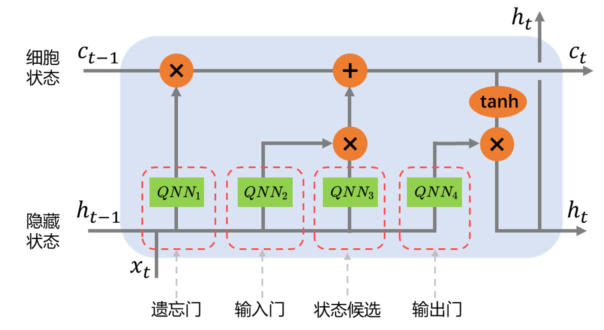
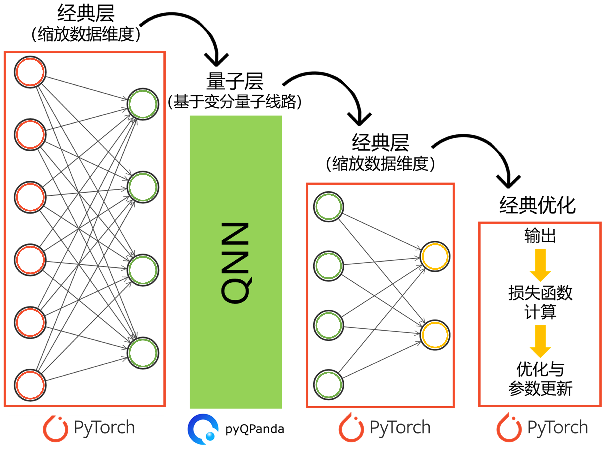

## 3.1 QLSTM 基本架构

本节简要介绍本研究中所使用的 QLSTM 的基本架构。量子加强的 LSTM 单元的设计主要受 Chen 等[71]研究的启发，大体上是利用量子神经网络（QNN）层替代经典 LSTM 神经网络中的权重更新相关过程以构建混合量子-经典算法。较之先前研究[71]中设计的 QLSTM，本研究中所使用的 QLSTM 单元对细胞状态与隐藏状态的输出不加以 QNN 处理，从而减少了 QNN 层使用的数量，如图 3.1.1 所示，一个 QLSTM 单元使用共 4 个 QNN 层。

    
<label>图 3.1.1 QLSTM 单元结构</label>

QLSTM 模型中的 QNN 层替代了经典 LSTM 单元中使用的经典神经网络层，从而将 LSTM 中门控机制相关的四个计算环节引入量子计算辅助，即：

$$
\begin{align*}
f_t = \sigma(W_f \cdot [h_{t-1},x_t] + b_f) \rightarrow f_t  = \sigma( \mathbf{QNN_1}( [h_{t-1},x_t] )) \\

i_t = \sigma(W_i \cdot [h_{t-1},x_t] + b_i) \rightarrow  i_t  = \sigma( \mathbf{QNN_2}( [h_{t-1},x_t] )) \\

\tilde{c_t} = \tanh(W_c \cdot [h_{t-1},x_t] + b_c) \rightarrow  \tilde{c_t}  = \tanh( \mathbf{QNN_3}( [h_{t-1},x_t] )) \\

o_t = \sigma(W_o \cdot [h_{t-1},x_t] + b_o) \rightarrow o_t  = \sigma(\mathbf{QNN_4}( [h_{t-1},x_t] )) \\
\end{align*}
$$

其中的 $QNN_i(·)$ 将量子层视作一个把经典输入数据转为经典输出数据（基于量子测量）的映射。不同于 Chen 等的架构，本研究设计的 QLSTM 模型考虑到解决实际问题情况下输入数据维度明显大于 NISQ 时代可用量子比特数目的情况，基于 2.3.5 节的混合量子-经典神经网络架构设计 QLSTM 中的 QNN 层，即在变分量子线路前后增加经典的全连接层以匹配经典输入输出维度与可用量子比特数目。

故上述 QLSTM 架构中使用的 QNN 层实际可表示为 $QNN_i(·) = FC_i^{out}( VQC_i ( FC_i^{in}(·) ))$。其中 $FC_i^{in}(·)$ 与 $FC_i^{out}(·)$ 均为经典的全连接层，分别处理将输入数据维度到量子比特数以及量子比特数到输出维度的维度匹配。$VQC_i$ 为变分量子线路，真正起到量子神经网络层的作用。所设计的 QLSTM 中使用的 VQC 层的结构见 3.2 节。其参数将经由经典的优化过程在经典计算机上完成。故而 QLSTM 整体的量子深度学习方案如图 3.1.2 所示（图中神经网络节点数仅作示意）。其中基于变分量子线路的量子层在本研究中由量子应用框架 pyQPanda 完成；其余经典处理部分（包括缩放数据维度的全连接层以及参数优化过程）由深度学习库 PyTorch 实现，详细配置见 3.4 节。基于该架构可使 QLSTM 在实际量子比特数有限的情况下无需考虑复杂的量子编码等解决方案而直接应用于大多数真实问题。

    
<label>图 3.1.2 QLSTM 深度学习方案</label>

此外，QLSTM 同样可以按 2.1.3 节所示，像经典 LSTM 一样进行堆叠以进一步加强表征能力。