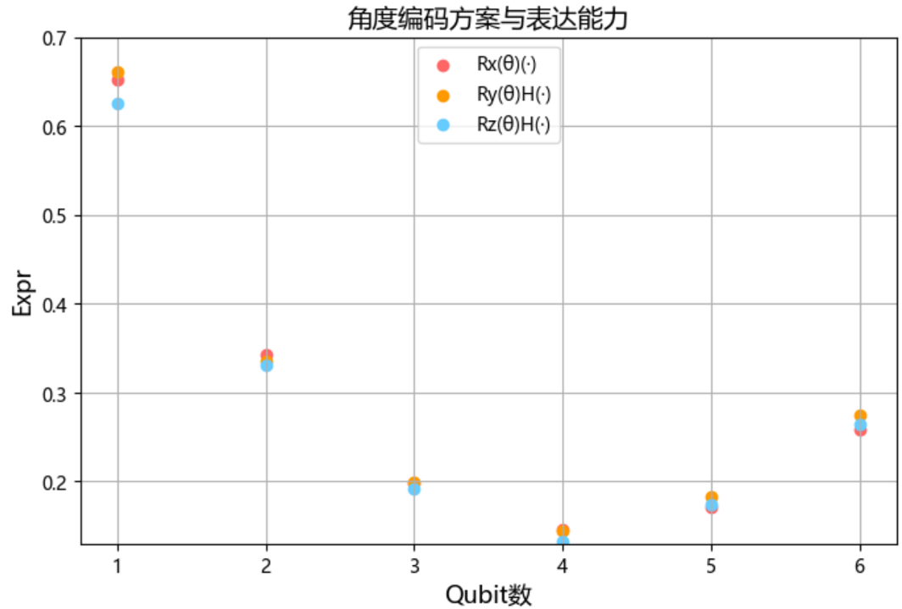
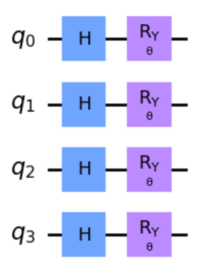

### 3.2.1 编码层设计

如 2.3.1 节指出的，编码层主要起到将经典输入数据转为（编码为）量子神经网络真正可处理的量子态的作用。角度编码具有编码简单、常数级深度等原因使其成为 NISQ 时代变分量子算法设计中常用的量子编码方案[82]。本节主要基于角度编码方案挑选设计编码层。

图 2.3.1.2 所示了基于三种不同旋转门角度编码方案的效果可视化，对于角度编码而言，编码生成状态的能力相对重要，基于 2.3.6 节所提及的可表达性指标对三种不同旋转门编码方案在不同量子比特数下的编码表达能力进行估算，结果如图 3.2.1.1 所示（每一编码方案对不同量子比特数分别采样 5000 次进行表达能力估算）。排除概率分布估计导致的可表达性计算的不稳定性，大体上可以认为三种编码方案的表达能力在不同量子比特数情况下相当。

<label>图 3.2.1.1 角度编码方案与表达能力</label>

本研究选用其中的基于 $R_y$ 旋转门的角度编码方案，其编码线路如图 3.2.1.2 所示。如 2.3.1 节所提到的，角度编码方案中由于会将经典数据编码至旋转门角度参数，且该参数基于三角函数将具有周期性，使得不同数据可能编码至同一量子态。故而基于该角度编码方案，在输入经典数据之前需进行必要的标准化等预处理操作。

<label>图 3.2.1.2 编码层：$R_y(\theta)H(·)$</label>

