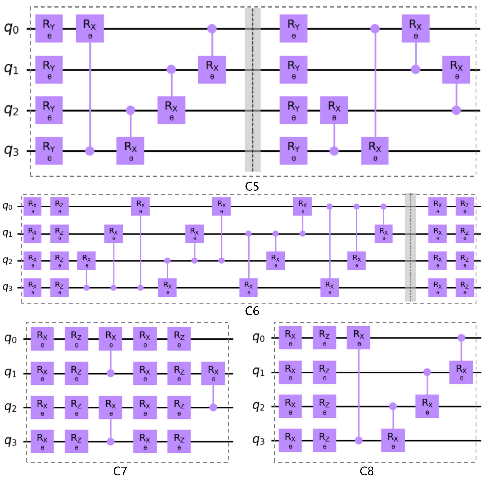

### 3.2.2 变分层设计

如 2.3.2 节所示，变分量子线路的结构本身也得到了广泛的研究，通常将其主体的变分层结构称为拟设（不包含编码与测量部分）。不同的拟设在量子线路表达能力、纠缠能力以及线路构造成本等多方面具有一定的差异[84]，因而为 QNN 挑选合适的拟设也成了影响 QNN 表达能力、效用等的重要因素之一。本节主要讨论本研究中使用的变分量子线路中拟设的设计与筛选。当相关的讨论过程也可以作为未今后在其他情境下设计合适变分量子线路结构时候的参考。

图 3.2.2.1（1）给出了先前 QLSTM 研究[71]中为量子层所设计的拟设，图 3.2.2.1（2）给出了本研究中所设计的拟设方案。在本研究的拟设方案中，使用了可具有 $d$ 个旋转相关参数的 $U_d，d \in \{1,2,3\}$ 系列通用旋转门来构建旋转层，主要基于较之使用一般的单参数旋转门，使用 $U_d$ 系列旋转门可以进一步增加线路的可配置性（换言之，$d$ 的选择也成为模型的超参数之一），图 3.2.2.1（2）所示即基于不同 $d$ 选择所对应的拟设。另一方面，基于 $CZ$ 门构建拟设中的纠缠层，主要考虑到 $CZ$ 的实际构造成本低于 $CNOT$ 门，以试图提升该拟设方案的硬件可实现性。此外，变分层本身可以类同经典神经网络层一样不断堆叠以进一步加深网络结构。图 3.2.2 中的虚线框部分给出了不同拟设方案中可迭代的结构部分。

<label>图 3.2.2.1 先前研究以及本研究中设计的拟设</label>

Sim 等人[84]基于可表达性、纠缠能力等角度分析评价了一系列拟设结构，并选出了其中较好的几类，此处选择了其中被认为最具有表达能力的几类典型拟设作为同本研究设计的拟设的比较参考，如图 3.2.2.2 所示（$C5 \sim C8$ 分别对应其中的线路 ID[84]：14，6，8 与 19）。

<label>图 3.2.2.2 比较参考拟设</label>

对上述所有拟设（$C1 \sim C8$）在不同量子比特数、拟设类型与指标（可表达性与纠缠能力）组合下分别采样 5000 次计算，结果如图 3.2.2.3 所示。大体上层数的堆叠会提升可表达性与纠缠能力，故此处仅给出一层情况下的结果。由于难以具体说明表达能力与纠缠能力对 QNN 效果具体的影响以及相应的影响比重，此处主要观察不同拟设间相对的指标水平。粗略来看，本研究设计的拟设方案中基于 $d=1$ 时的拟设具有相对降低的表达性与纠缠能力，但基于 $d=2$ 以及 $d=3$ 的拟设方案在不同量子比特数下两个指标水平均处在所有比较的拟设中的中上水平，并分别在纠缠能力以及表达性水平上得到了所有拟设中的次好水平。Sim 等人[84]研究中选出的最好拟设（对应此处实验中的 $C6$）在本组实验中也表现出了最好水平。但除表达能力与纠缠能力外，拟设构造相关的成本指标也需要考虑。下表给出了所有比较的拟设的几项成本指标，包括量子门总数、双比特门个数、参数总数以及线路深度。

<label>图 3.2.2.3 不同拟设的可表达性与纠缠能力</label>

成本指标中对量子算法影响较大的是线路深度，其直观反应了线路构造与实现的难度。图 3.2.2.4 给出了上述不同拟设类型对应的线路深度随量子比特数量的关系。如表中所示，所考虑的拟设方案的线路深度均与叠加层数 $L$ 线性相关，图 3.2.2.4 中仅给出了 $L=1$ 以及 $L=3$ 时候的比较结果作为参考。从图中结果来看，拟设 $C6$ 具有明显超过其他拟设的线路深度复杂度。相对而言，本研究所设计的拟设在参数数量变化下具有一致的线路深度，且线路深度表现在所比较的拟设方案中仅次于 $C7$，但前述实验表明 $C7$ 在表达能力与纠缠能力上相对不佳。

从其余成本指标来看，拟设 $C6$ 在所有指标上均有最高的复杂度，而其余拟设的成本指标大致上复杂度相同，其中本研究设计的拟设（$C2 \sim C4$）在量子门总数、双比特门数上都有相对最优的复杂度表现。且本研究设计的该组拟设方案保证了参数数量随 $d$ 的取值不同而灵活变化的同时其余成本均不变。

| 序号 | 量子门总数 | 双比特门数 | 参数总数 | 线路深度 |
| ---- | ---------- | ---------- | ------ | -------- |
| C1   | $3nL$        | $2nL$        | $3nL$    | $(2n+1)L$  |
| C2   | $n(2L+1)$          | $nL$          | $\mathbf{n(L+1)}$       | $\mathbf{(n+1)L+1}$       |
| C3   | $n(2L+1)$         | $nL$           | $\mathbf{2n(L+1)}$      | $\mathbf{(n+1)L+1}$        |
| C4   | $n(2L+1)$          | $nL$           | $\mathbf{3n(L+1)}$      | $\mathbf{(n+1)L+1}$        |
| C5   | $(3n+\frac{n}{gcd(n,3)})L$  | $(n+\frac{n}{gcd(n,3)})L$          | $(3n+\frac{n}{gcd(n,3)})L$      | $(2+n+\frac{n}{gcd(n,3)})L$       |
| C6   | $\mathbf{(n^2+3n)L}$          | $\mathbf{(n^2-n)L}$           | $\mathbf{(n^2+3n)L}$       | $\mathbf{(n^2-n+4)L}$        |
| C7   | $(5n-1)L$          | $(n-1)L$          | $(5n-1)L$      | $\mathbf{6L}$       |
| C8   | $3nL$          | $nL$          | $3nL$      | $(n+2)L$       |

<label>图 3.2.2.4 线路深度同量子比特数量关系</label>

综合考虑表达性与纠缠能力以及成本指标，所提出的拟设方案具有相对中上的表达能力与纠缠能力的同时（ $d=1$ 时除外），具有综合来看所比较拟设中较低的成本。同时通过增加 $d$ 这一超参数也使得该拟设方案具有在量子比特数、层数之外的可配置性。