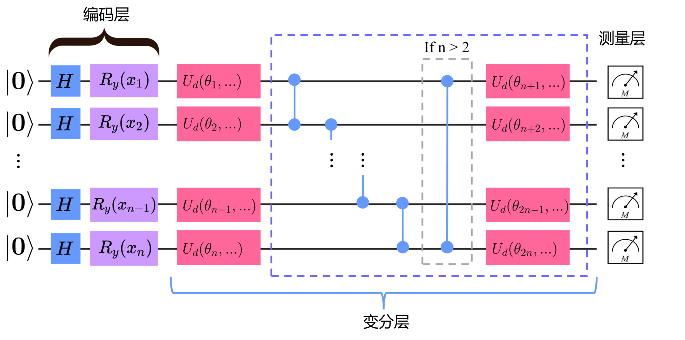

## 3.2 变分量子线路设计

变分量子线路（VQC）充当我们所使用的 QNN 层中的主体部分，作为可训练的带参量子线路，VQC 将用于在不断地训练过程中拟合目标函数。如 2.3 节所示，变分量子线路又可以依据具体职责划分为编码层、变分层与测量层等。本节介绍本研究所设计的 QLSTM 中使用的变分量子线路部分的设计与详细的筛选过程。

### 3.2.1 编码层设计 √

### 3.2.2 变分层设计 √

### 3.2.3 测量层设计 √

最后，总结上述各个部分的设计，图 3.2.1 给出了本研究中用以构成 QNN 的变分量子线路的结构。

<label>图 3.2.1 变分量子线路结构</label>

