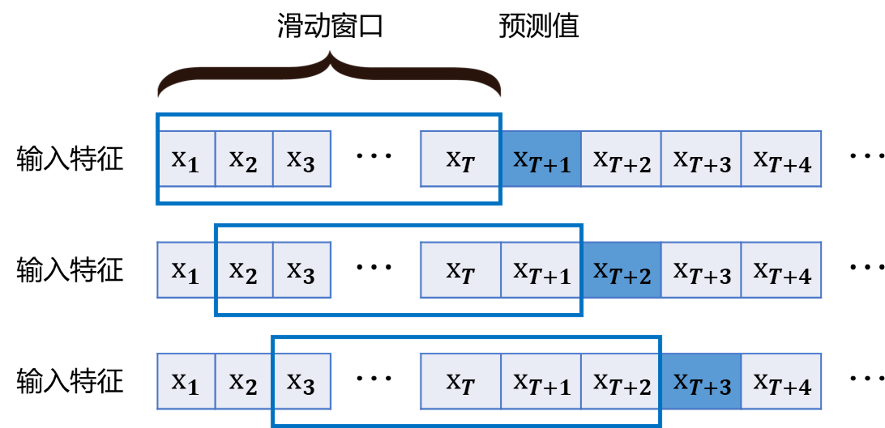

### 3.3.1 数据预处理

此部分在经典计算机上完成，包括对原始数据的缺省值处理等预处理过程以及用于训练模型的数据集划分等。

预处理过程中由于 QLSTM 中量子层使用的角度编码的特性（见 3.2.1 节的讨论），需要对原始数据进行必要的数据缩放操作以确保模型的训练过程顺利。本实验中对原始数据进行标准化操作以更好地保持样本间距。

另一方面，对于基于 LSTM 类模型的时序预测问题，常需要就时序数据进行必要的处理以转为 LSTM 类模型可接受的输入格式。典型的包括将时序数据进行滑动窗口处理，例如图 3.3.1.1 所示，可以将所有数据特征展平后在所有特征上滑动以生成固定大小（图中所示即 $T$）的窗口，从而 LSTM 的任务为基于大小 $T$ 的输入特征窗口序列生成（预测）下一个特征值。本研究中使用的 QLSTM 模型也采用此种基于滑动窗口的预测方式。

<label>图 3.3.1.1 LSTM 滑动窗口预测</label>

