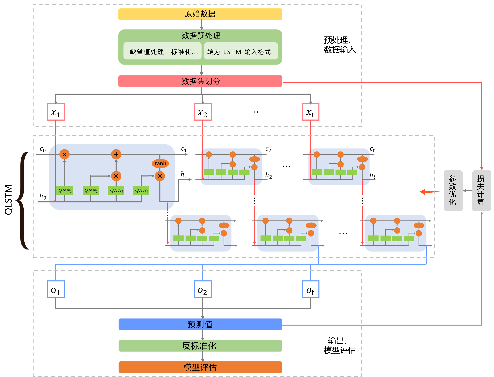

## 3.3 模型训练

图 3.3.1 给出了基于所提出的 QLSTM 模型用于时序预测问题的训练过程。具体包括经典数据的预处理、基于迭代参数优化训练 QLSTM 模型的过程以及最终的数据输出和模型评估等。本节介绍了训练过程中的一些细节。

<label>图 3.3.1 QLSTM 训练流程</label>

### 3.3.1 数据预处理 √

### 3.3.2 损失函数与优化 √

### 3.3.3 模型评估 √