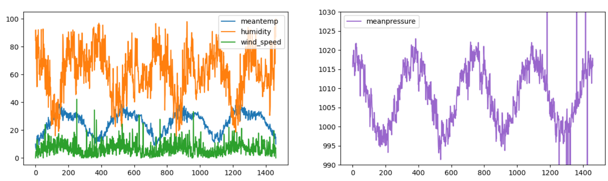

### 3.4.1 问题描述

为测试 QLSTM 在解决多变量时序预测问题上的可行性，本研究从数据竞赛平台 Kaggle 选取一个公共数据集作为目标问题，该数据集是一个有关 2013 - 2017 年德里市每日气候数据的真实时间序列数据集，共包含 4 个气候变量，包括以预先分好的 1462 行训练数据和 114 行测试数据[92]。该预测问题的目标是根据最近 n 天的历史观测数据预测未来一天的天气状况（包括四个气象指标）。

原始训练数据集如图 3.4.1.1 所示，明显含有一定的异常值，故需对原始数据将进行必要的异常值处理（检测出 8 个异常值，使用邻近的平均值进行修正），此外还需进行标准化以及基于滑动窗口法生成特征与标签的训练数据序列等预处理操作，详情如 3.3.1 节所描述的。

<label>图 3.4.1.1 气象预测数据集</label>

