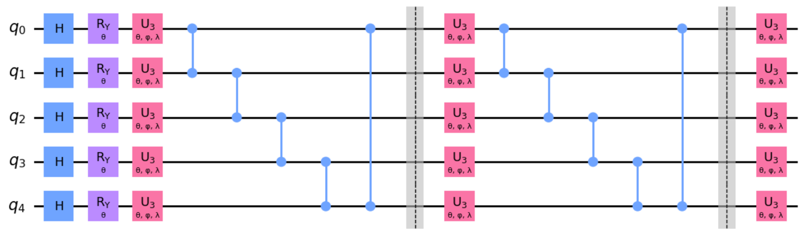

### 3.4.2 模型配置

首先，选定 $n=3$ 即基于过去 3 天的历史数据来预测未来一天的气象指标。则特征维数为 4，输入特征维数（亦即窗口大小）为 $4 \times 3$，选定 QLSTM 隐藏层状态维数为 $hidden\_size = 32$，设定 QLSTM 模型堆叠层数为 $layer=2$。此外，使用 MSE 作为损失函数，选用 Adam 优化器（优化器超参数为：$\alpha=0.001，\beta_1=0.9，\beta_2=0.999，\epsilon=10^{-8}$）。训练时选定批大小 $batch\_size = 20$，训练轮次 $epoch = 100$。

此外，QLSTM 模型中的 4 个 QNN 层中的 VQC 部分的结构选定如图 3.4.2.1 所示。选定通用旋转门类型 $d=3$（即 VQC 层中使用的旋转门均为 $U_3$ 旋转门），量子比特数 $n=5$，变分层堆叠次数 $L=2$。则对单个该 VQC 层，使用的参数总数为 $3n(L+1) = 45$。QLSTM 模型共使用 4 个 QNN 层，则基于上述配置的 QLSTM 模型使用共 180 个与量子变分层直接相关的参数（即不包含经典全连接层的参数总数）。 

<label>图 3.4.2.1 VQC 配置</label>

