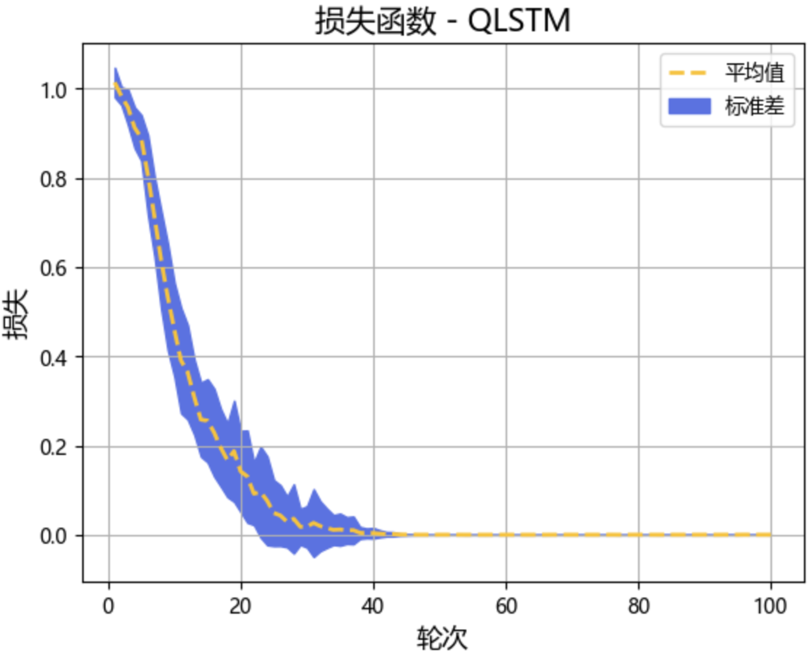
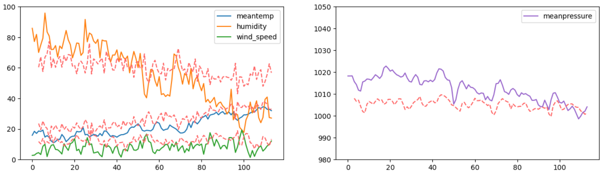

### 3.4.3 实验结果

针对目标数据集，基于前述 QLSTM 模型进行了 10 次重复训练（选定学习率 0.0035），其损失函数的下降情况如图 3.4.3.1 所示。可见基于所提出的 QLSTM 模型可以针对该多变量时序预测问题可以较好的收敛，具有一定的可用性。

<label>图 3.4.3.1 QLSTM 损失函数下降情况</label>

其中一次运行在测试集上的预测结果如图 3.4.3.2 所示（虚线对应预测结果）。大体上可以表现四个指标的一定趋势，为更好地衡量训练结果，下表给出了 QLSTM 模型在不同评价维度上的表现（相关评价指标见 3.3.3 节）。同时作为比较，同样的训练实验也在经典 LSTM 模型上进行，为体现 QLSTM 模型优势，对照的 LSTM 模型选用相同的配置（无量子层相关配置，学习率独立选取），结果一并在下表中给出。

<label>图 3.4.3.2 QLSTM 预测结果</label>

| 模型  | accuarcy(%) | RMSE    | MSE      | MAE    |
| ----- | ----------- | ------- | -------- | ------ | 
| QLSTM | 98.58       | 9.6539 | 96.0889 | 7.4678 | 
| LSTM  | 98.57       | 10.3096 | 106.2882 | 7.5382 | 

总体来看，当前方案的 QLSTM 和 LSTM 在该时序预测问题上表现相当，QLSTM 在多个损失相关指标上表现略好于 LSTM，下表给出了四个气象指标的具体表现情况，除在平均气压（meanpressure）指标上逊于经典 LSTM 外，QLSTM 针对其余气象指标的预测结果均相对 LSTM 有一定优势 。第 4 章会针对优化 QLSTM 效果进行进一步讨论。

| 模型  | 气象指标         | RMSE    | MSE      | MAE     | 
| ----- | ------------ | ------- | -------- | ------- | 
| QLSTM | meantemp     | 4.3963  | 19.3271  | 3.4243  | 
| LSTM  |              | 5.4446  | 29.6434  | 4.7483  | 
| QLSTM | humidity     | 16.1398 | 260.4942 | 13.2409 |
| LSTM  |              | 17.5581 | 308.2875 | 15.0133 | 
| QLSTM | wind_speed   | 4.6828  | 21.9286  | 3.7154  |
| LSTM  |              | 6.9558  | 48.3833  | 6.1361  |
| QLSTM | meanpressure | 10.6589 | 113.6119 | 9.3776  | 
| LSTM  |              | 5.2346  | 27.4010  | 4.4070  | 

值得说明的是，该实验不能表明所提出的 QLSTM 模型具有明显优于经典 LSTM 模型的表现，同时经典 LSTM 模型在经过更细致的设计后很可能能发挥更加优秀且稳定的表现。但上述实验能初步表明所提出的 QLSTM 模型方案针对多变量时序预测问题具备一定可行性。

此外，考虑 QLSTM 模型的一个优势，上述 LSTM 模型和 QLSTM 模型均采用 3.4.2 节的配置，在条件相同的情况下，LSTM 模型共有 14468 个训练参数，相对而言，QLSTM 模型仅使用 4228 个训练参数（多为经典的全连接层相关的参数），其中仅有 180 个 VQC 直接相关的参数。换言之基于量子加强的  QLSTM 模型方案在训练参数数量上较之经典 LSTM 模型具有一定优势。并且可预见的是，随着可用量子比特数的增加（亦即需要更简单或不需要全连接层进行输入输出维度转换）的情况下，这一优势会更加明显。而更少的参数数量以及如图 3.4.2.1 所示较简单的网络拓扑结构意味着 QLSTM 在基于更为简单的模型结构的基础上能够发挥出和经典 LSTM 模型相近甚至略胜过的表现，暗示着基于 QNN 的量子深度学习模型可能具有更优秀的逼近能力。