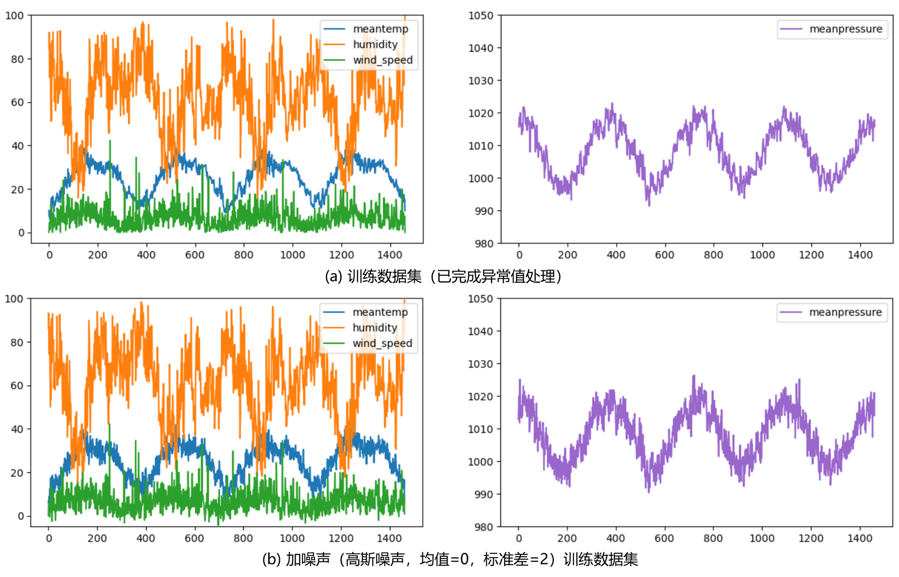
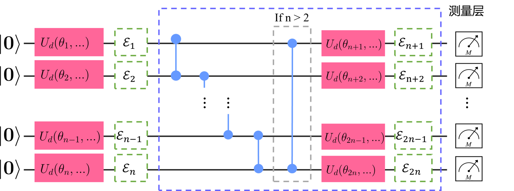
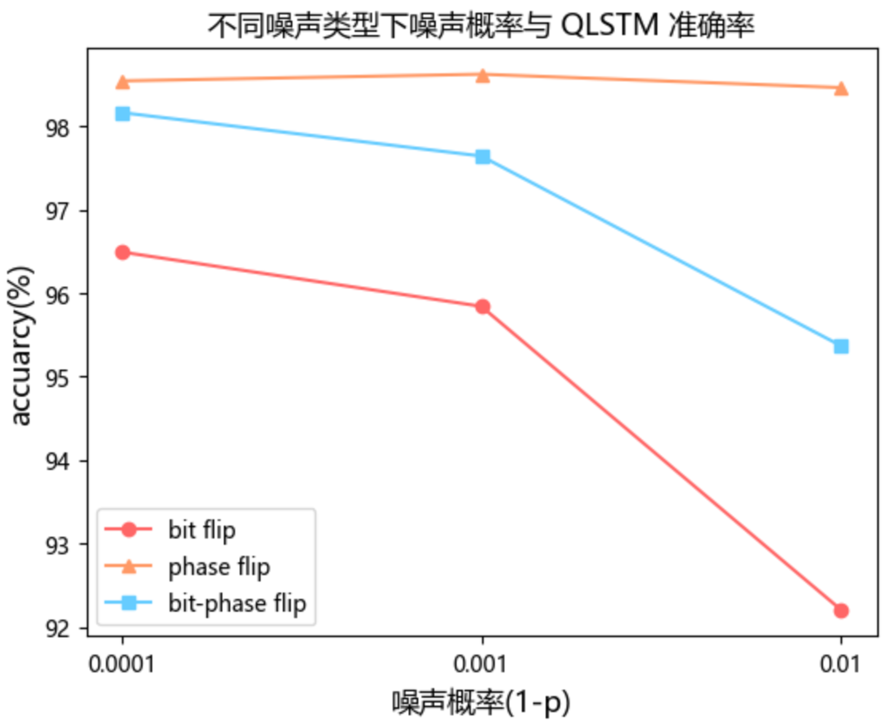
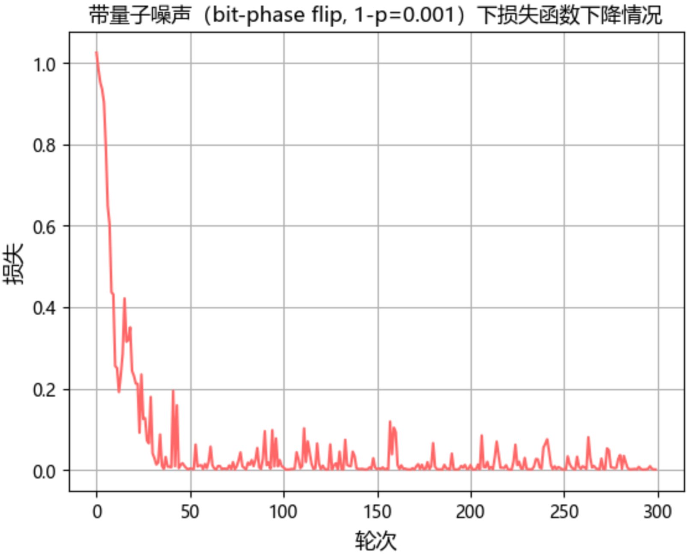

### 3.4.4 噪声鲁棒性分析

通常基于 VQC 构建的 QNN 有望能获得相对更好的噪声鲁棒性[73]，此节简要分析上述 QLSTM 模型的噪声鲁棒性。包括考虑模型对带噪声数据的鲁棒性，以及针对量子系统特有的量子噪声鲁棒性问题。

对于前者，即考虑数据集本身带噪声的情况下，严格的证明或衡量模型的鲁棒性较为困难，此处通过模拟带噪数据实验来初步验证。首先通过为训练数据集添加一定强度的高斯白噪声来模拟带噪声数据集（如图 3.4.4.1 所示），在不同噪声强度的带噪训练数据集下训练结果如下表所示。表中结果均为重复训练 10 次（每次 100 轮）的平均结果。可见 QLSTM 在所测的不同强度带噪数据集下训练结果都相对稳定，可以认为其对带噪数据，或至少针对该时序预测问题情境，具备一定的鲁棒性。

<label>图 3.4.4.1 噪声训练数据集模拟</label>

| 序号 | 高斯噪声标准差 | accuarcy(%) | RMSE   | MSE     | MAE    |
| ---- | -------------- | ----------- | ------ | ------- | ------ |
| 1    | 0.05           | 98.61       | 9.5151 | 94.3997 | 7.1856 |
| 2    | 0.1            | 98.66       | 9.1881 | 84.7436 | 6.8524 |
| 3    | 0.5            |    98.64         | 9.3254       |  90.1404         |  7.0587        |
| 4    | 1              | 98.65       | 9.2164 | 87.4194 | 6.9810 |
| 5    | 2              | 98.63       | 9.4246 | 89.1302 | 7.0768 |

另一方面，对于开放量子系统而言，量子噪声是普遍存在的环境对系统的影响，尤其在 NISQ 时代量子噪声更是对量子算法运行稳定性的极大威胁。图 3.4.4.2 给出了考虑单比特量子噪声的变分量子线路的线路模型。其中每个 $\mathcal{E}_i$ 为一个量子噪声，以 $\mathcal{E}_i(\rho) = \sum_k E_k\rho E_k^\dagger$ 的形式建模，其中 Kraus 算子满足归一化条件 $\sum_kE_kE_k^\dagger=I$，详见 2.2.6 节。

<label>图 3.4.4.2 带噪声变分量子线路模型</label>

此处分析 QLSTM 的量子噪声鲁棒性，即在不同程度与类型的环境量子噪声影响下，模型的预测性能保持稳定的能力。为此考虑三种单比特量子噪声类型：比特翻转、相位翻转与比特-相位翻转。针对每种量子噪声类型，选择三种噪声概率（1 - p）分别进行 10 次重复实验，其中量子噪声经由 PyQPanda 在本地环境下模拟。实验的平均结果见下表所示。图 3.4.4.3 更直观的表示了不同噪声类型在不同噪声概率下对 QLSTM 预测准确率的影响。从实验结果可以看出，所测试的三种噪声类型中相位翻转对 QLSTM 预测性能的影响较小（至少在所测试的噪声概率范畴内），比特翻转噪声对 QLSTM 预测性能的影响最大。这一结论与其他有关部分量子算法中的噪声影响的分析结论是一致的[93]，量子噪声依旧是 NISQ 时代影响量子算法运行的主要限制因素之一。  

| 序号 | 噪声类型      | 噪声概率（1-p） | accuarcy(%) | RMSE    | MSE       | MAE     |
| ---- | ------------- | --------------- | ----------- | ------- | --------- | ------- |
| 1    | 比特翻转      | 0.0001          | 96.49       | 20.7736 | 751.4732  | 18.1739 |
| 2    |               | 0.001           | 95.84       | 25.4477 | 931.0076  | 21.5394 |
| 3    |               | 0.01            | 92.21       | 47.6367 | 2447.3348 | 40.3919 |
| 4    | 相位翻转      | 0.0001          | 98.54       | 10.1833 | 108.5240  | 7.5439  |
| 5    |               | 0.001           | 98.62       | 8.8759  | 81.2951   | 6.6195  |
| 6    |               | 0.01            | 98.46       | 9.7876  | 95.7972   | 7.9785  |
| 7    | 比特-相位翻转 | 0.0001          | 98.16       | 11.8768 | 157.8079  | 9.5497  |
| 8    |               | 0.001           | 97.64       | 14.7980 | 243.8187  | 12.2411 |
| 9    |               | 0.01            | 95.37       | 29.2912 | 1172.3313   | 23.9734 |

<label>图 3.4.4.3 不同噪声类型下噪声概率与 QLSTM 准确率关系</label>

图 3.4.4.4 给出了一次带量子噪声（比特-相位翻转，1 - p=0.001）环境下训练 QLSTM 的损失函数结果，可以看出量子噪声的存在使得损失函数的下降过程以及在收敛范围附近均存在较频繁的抖动。从环境角度减少量子噪声的发生可能较为困难，为缓解环境量子噪声带来的性能影响，除调整模型结构本身外，可以借鉴经典机器学习对带噪声数据训练的解决思路。例如此时可以适当调整学习率与训练轮数并利用正则化手段，包括提早停止等干预来改良带量子噪声下的训练效果。在本地实验中通过上述措施可以一定程度上提升带量子噪声环境下的训练效果。此外，4.4 节中还会讨论利用量子神经网络正则化技术来进一步应对量子噪声环境下的 QLSTM 训练。

<label>图 3.4.4.4 带量子噪声下损失函数下降情况</label>

本节主要通过实验表明所构建的 QLSTM 模型具有一定应对带噪声数据集的鲁棒性。对于量子环境下的三类单比特量子噪声，实验表明相位翻转噪声对 QLSTM 的性能影响有限，比特翻转较大的影响了 QLSTM 模型的训练过程，为保证量子噪声环境下 QLSTM 训练的稳定性，有必要引入正则化等辅助技术。