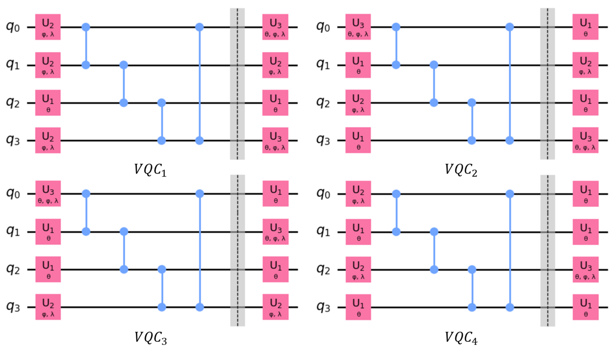
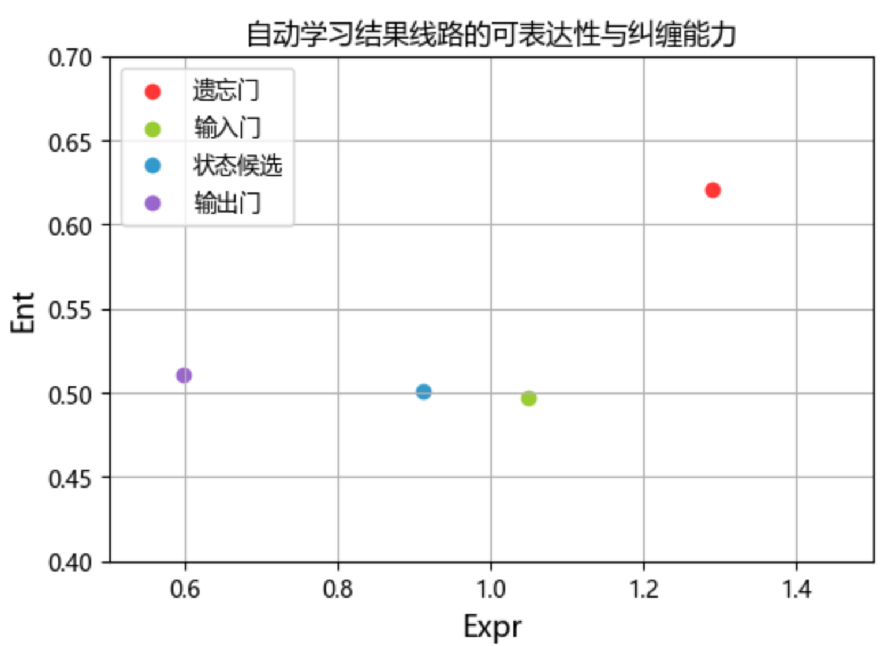

### 4.1.2 自动学习 VQC 结构

4.1.1 节中基于先验知识对各个 VQC 结构进行干预，本质上是将不同层的结构配置（量子比特数 n、层数 L、旋转门类型 d）也视为模型的超参数并不断调整得到较优的模型。从而可以配合网格搜索、随机搜索等自动调参技术来自动学习最优的 VQC 结构。

本节基于随机搜索方案尝试自动学习较优的 VQC 结构。具体而言每次训练随机生成一组结构参数，决定一组 VQC 结构进行训练，多次重复训练保留最优结果。为简化随机搜索空间，选定量子比特数 $n=4$ 且固定变分层叠加次数 $L=1$ 以及固定学习率等，故训练的目标主要是找出不同 VQC 线路中旋转门的使用组合（即允许单个 VQC 线路中使用不同的通用旋转门组合）。随机搜索 50 次后最优的结果如图 4.1.2.1 所示，相应的评估结果见表（对应 AutoQLSTM ，相应实验数据为单次结果）。

<label>图 4.1.2.1 自动学习 VQC 结构结果</label>

其中不同门控机制对应的 VQC 所需参数总数如下表所示。可见结论同先验结论相一致，遗忘门拥有最高的复杂性（参数总数），输出门具有最少的复杂性。

| 序号  | 对应门控机制 | 参数总数 |
| ----- | ------------ | -------- |
| VQC_1 | 遗忘门       | 16       |
| VQC_2 | 输入门       | 14       |
| VQC_3 | 状态候选     | 14       |
| VQC_4 | 输出门       | 12       |

考虑此时各个 VQC 的量子比特数量一致，可以基于可表达性指标进行细致的评价，结果如图 4.1.2.2 所示。同样的，遗忘门对应 VQC 的可表达性与纠缠能力均为最高，输出门对应的可表达性能力最低。自动学习的结果也一定程度上支持了已有的对不同门控机制的重要性断言在所提出的 QLSTM 模型下依旧是成立的。

<label>图 4.1.2.2 自动学习结果线路的可表达性与纠缠能力</label>

当然，上述自动学习 VQC 结构的方案仅是一种探索性的尝试，具有较大的时间复杂度，尤其是如果将量子比特数、叠加层数等超参数一并考虑时将更加难以运用。此外结果有较大的不确定性，事实上求得的最佳方案在重复实验下不稳定，可能需要改良的自动学习方案以求取较稳定的最优结构。但通过上述实验表明了所提出的 VQC 架构的可配置性，以及一定程度上支持了 4.1.1 节基于先验知识调整 VQC 结构的合理性。
