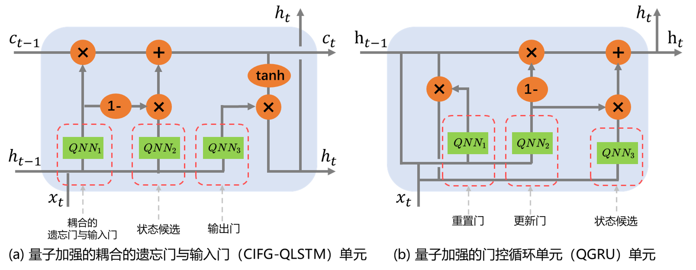

## 4.2 QLSTM 变体设计与实现

如 2.1.4 节描述的经典 LSTM 具有广泛研究的众多变体，包括窥视孔连接、耦合的输入门与遗忘门以及门控循环单元等。则基于 3.1 节的思路可以同样设计不同 LSTM 变体模型的对应量子版本。

其中窥视孔连接主要是在 LSTM 基础上增加门控机制对单元状态的访问能力，故量子加强的窥视孔连接（peepholeQLSTM）相较 QLSTM 改动不大，同样是利用 QNN 层替换门控机制相关的权重更新过程，不同仅在于允许单元状态一并输入，即： 

$$
\begin{align*}
f_t = \sigma(W_f \cdot [\mathbf{c_{t-1}},h_{t-1},x_t] + b_f) \rightarrow f_t  = \sigma( \mathbf{QNN_1}( [\mathbf{c_{t-1}},h_{t-1},x_t] )) \\

i_t = \sigma(W_i \cdot [\mathbf{c_{t-1}},h_{t-1},x_t] + b_i) \rightarrow  i_t  = \sigma( \mathbf{QNN_2}( [\mathbf{c_{t-1}},h_{t-1},x_t] )) \\

\tilde{c_t} = \tanh(W_c \cdot [\mathbf{c_{t-1}},h_{t-1},x_t] + b_c) \rightarrow  \tilde{c_t}  = \tanh( \mathbf{QNN_3}( [\mathbf{c_{t-1}},h_{t-1},x_t] )) \\

o_t = \sigma(W_o \cdot [\mathbf{c_{t}},h_{t-1},x_t] + b_o) \rightarrow o_t  = \sigma(\mathbf{QNN_4}( [\mathbf{c_{t}},h_{t-1},x_t] )) \\
\end{align*}
$$

量子加强的窥视孔连接不改变门控机制数量，故一个量子加强的窥视孔连接单元同 QLSTM 单元一致使用 4 个 QNN 层。相对而言耦合的遗忘门与输入门（CIFG）与门控循环单元（GRU）均采取合并门结构的方式来简化 LSTM 单元结构，量子加强的耦合的遗忘门与输入门（CIFG-QLSTM）与量子加强的门控循环单元（QGRU）的结构如图 4.2.1 所示。CIFG-QLSTM 的原理主要是将一个耦合后的门结构（合并输入门与遗忘门，对应图中 $QNN_1$）的输出同时用于控制长时记忆遗忘与候选记忆筛选。其余门控机制不变。QGRU 的修改则如下：

$$
\begin{align*}
  r_t & = \sigma(W_r \cdot [h_{t-1}, x_t])  \rightarrow r_t  = \sigma( \mathbf{QNN_1}( [h_{t-1},x_t] )) \\

 u_t & = \sigma(W_u \cdot [h_{t-1},x_t])  \rightarrow u_t  = \sigma( \mathbf{QNN_2}( [h_{t-1},x_t] )) \\

  \tilde{h_t} &= \tanh (W \cdot [r_t \times h_{t-1}, x_t])  \rightarrow   \tilde{h_t} = \tanh ( \mathbf{QNN_3}( [r_t \times h_{t-1}, x_t] ))
\end{align*}
$$

    
<label>图 4.2.1 CIFG-QLSTM 单元以及 QGRU 单元结构</label>

对上述两类变体而言，由于均合并了部分门结构，单个单元仅需 3 个 QNN 层。从而较大的减少了相关参数的使用数量。

对应上述量子加强变体的实验数据见表 4 （每个模型均重复实验 10 次，记录平均值)。相应的损失函数下降情况如下图 4.2.2. 所示。可见所构建的不同 QLSTM 变体模型均能对该问题较好的收敛。

    
<label>图 4.2.2 QLSTM 变体损失函数下降情况</label>

针对不同模型单独调整 VQC 配置以及训练学习率，大体来看，peepholeQLSTM 的优化有限，相对的由于 CIFG-QLSTM 与 QGRU 简化了门结构，减少了 QNN 数量，在参数数量、训练时间等方面相较于原始的 QLSTM 有一定优势，同时在预测性能上均有提升。其中 QGRU 在实验中有最好的表现，最高的预测率达到 99.01% ，平均性能已经接近 4.1.2 节中自动学习的结果，但参数数量更少且表现更加稳定。其中一次基于 QGRU 的预测结果如图 4.2.2 所示。

    
<label>图 4.2.3 QGRU 预测结果</label>

QGRU 在各个指标上的表现同 QLSTM 以及 LSTM 的比较如下表所示，可见 QGRU 在所有待预测气象指标上都有优于原 QLSTM 的表现，并较原始 LSTM 有一定优势。

| 模型  | 气象指标         | RMSE    | MSE      | MAE     | 
| ----- | ------------ | ------- | -------- | ------- | 
| QGRU | meantemp     | 3.0567  | 9.3430  | 3.5274  | 
| QLSTM |     | 4.3963  | 19.3271  | 3.4243  | 
| LSTM  |              | 5.4446  | 29.6434  | 4.7483  | 
| QGRU | humidity     | 11.6512 | 135.7509 | 9.6974 |
| QLSTM |      | 16.1398 | 260.4942 | 13.2409 |
| LSTM  |              | 17.5581 | 308.2875 | 15.0133 | 
| QGRU | wind_speed   | 4.5116  | 20.3540  | 3.4481  |
| QLSTM |    | 4.6828  | 21.9286  | 3.7154  |
| LSTM  |              | 6.9558  | 48.3833  | 6.1361  |
| QGRU | meanpressure | 4.3023 | 18.5104| 3.6202  | 
| QLSTM |  | 10.6589 | 113.6119 | 9.3776  | 
| LSTM  |              | 5.2346  | 27.4010  | 4.4070  | 

本节的研究主要表明基于构建 QLSTM 模型的方案构建 LSTM 相关经典变体的对应量子加强版本的可行性。同时表明一些量子加强的 LSTM 改良版本能够在一定程度上获得较 QLSTM 更好的表现。 