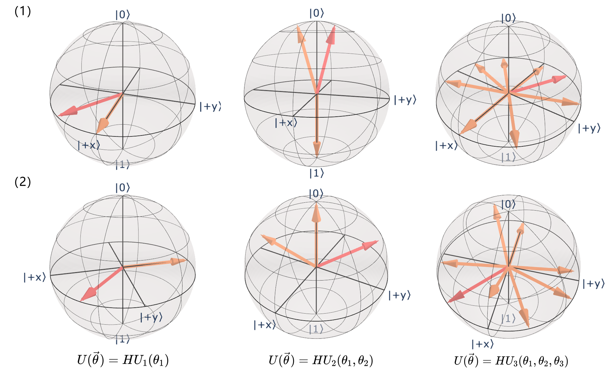

### 4.3.1 旋转角度重置正则化

注意到本研究设计的 QLSTM 模型中 VQC 层的旋转层部分由通用旋转门组 $\{U_d\}$ 实现。其中 $U_d$ 通用旋转门具有 $d$ 个角度参数。从避免过度参数化的角度来考量，事实上训练过程中可能不需要如此多的参数，如果在训练过程中适当干预部分旋转参数的更新过程，例如将其重置为 0 等则可能起到一定的正则化效果。

图 4.3.1.1（1）所示为使用不同类型旋转门下，每一旋转角度参数都有一定概率重置为 0 后的结果。其中红色向量为未发生角度重置的原始向量，其余 $2^d-1$ 个橙色向量对应发生旋转角度随机重置后的所有可能情况。对参数较多的 $U_3$ 旋转门而言，由于其本身的复杂性（详见 2.2.3 节），对其进行旋转角度随机重置的效应难以直观地解释，但大体上旋转角度随机重置在所有旋转门类型以及所有随机重置可能情况下都使得量子态偏离其原本位置。故可以将旋转角度随机重置的效果看做是一类加噪，类比于经典深度学习中使用的权重噪声技术。

<label>图 4.3.1.1 旋转角度随机重置</label>

本研究中基于不同的旋转角度重置概率 $p=0.001$ 以及 $p=0.005$ 对原始的 QLSTM 训练开展 10 次重复实验。其中 $p$ 意味着变分层中的通用旋转门的任一旋转角度参数在每一轮训练过程中均以概率 $p$ 发生重置。实验结果见下表所示。可以看到，选定适当的概率进行旋转角度的随机重置可以明显的提升 QLSTM 模型的预测性能。

| 旋转角度重置       | accuarcy(%) | RMSE   | MSE     | MAE    |
| ------------------ | ----------- | ------ | ------- | ------ |
| 无                 | 98.59       | 9.6539 | 96.0889 | 7.4678 |
| 重置为0（p=0.001） | 98.78       | 8.1998 | 68.0784 | 6.3389 |
| 重置为0（p=0.005） | 98.69       | 8.6719 | 76.8966 | 6.8101 |
| 重置为π（p=0.001） | 98.80       | 8.3744 | 71.2053 | 6.2105 |
| 重置为π（p=0.005） | 98.67       | 8.9396 | 79.9564 | 6.8695 |

另外，实验中还考虑重置为其他固定值的情况，例如图 4.3.1.1（2）所示为随机重置为 $\pi$ 的结果。同样的，旋转角度随机重置为 $\pi$ 会另量子态发生不同程度的偏离，同样基于重置概率 $p=0.001$ 以及 $p=0.005$ 的实验也在上表中给出。可以看到，将旋转角度随机重置为 $\pi$ 也具有一定的性能提升作用。本质上这两种不同的旋转角度随机重置都可以看做为通用旋转门随机加噪的正则化处理。上述实验可以认为基于旋转角度重置的正则化方法对提升 QLSTM 模型性能具有一定的作用。