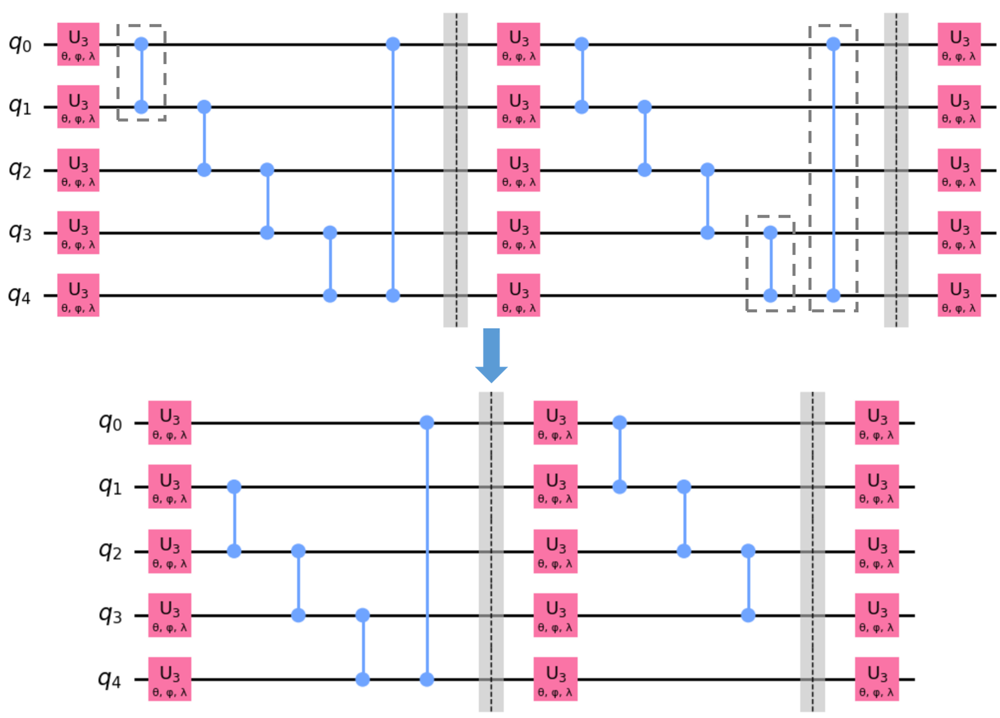
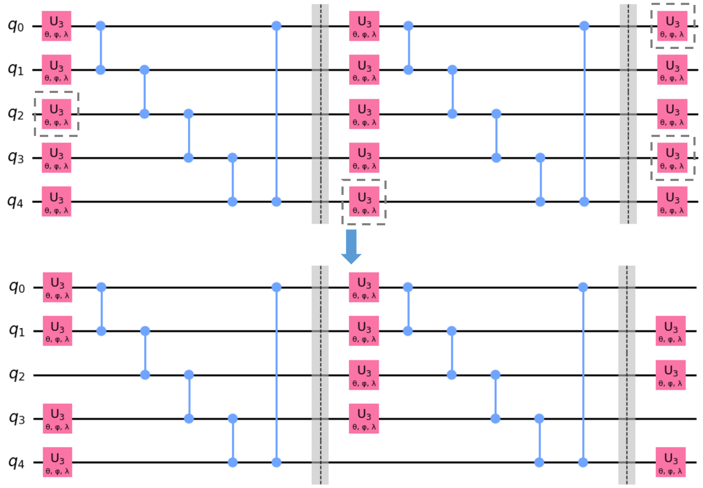
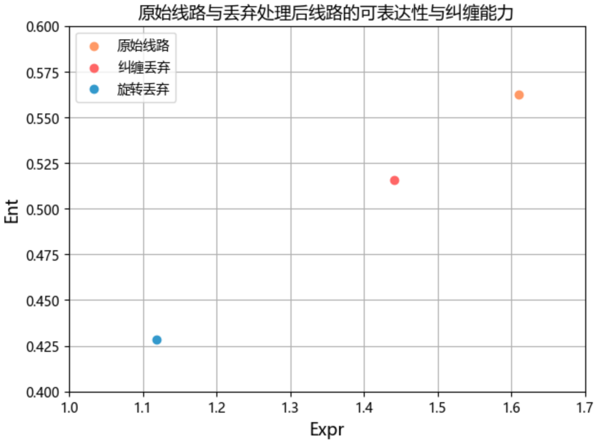

### 4.3.2 基于量子门的丢弃法

丢弃法（dropout method）是经典深度神经网络训练过程中常用的一种正则化方法。其通过在训练过程中随机丢弃一部分神经元来避免过拟合的发生。Kobayashi 等[95]提出了一种类比经典丢弃法，可应用于基于变分量子线路的量子机器学习的纠缠丢弃法（entangling dropout）方法。其原理主要是在每次训练过程中基于一定的丢弃概率丢弃用于生成量子纠缠的双比特量子门，从而削减量子线路的表达能力。其实验表明这种纠缠丢弃可以起到一定的避免过拟合的作用。

注意到变分量子线路中的变分层由旋转层与纠缠层组合而成（见 2.3.2 节），上述纠缠丢弃法事实上影响了变分层中的纠缠层部分。类比这一技术，通过随机丢弃旋转门以影响旋转层则得到了旋转丢弃方法。上述两类方法本质上都是以一定概率随机丢弃量子线路中的特定量子门，因而此处统称为基于量子门的丢弃法。

本节通过实验探讨纠缠丢弃法以及旋转丢弃法对于 QLSTM 性能提升的有效性。图 4.3.2.1 所示为基于本研究中使用的变分层的纠缠丢弃法示意图。其中纠缠层的每一个 CZ 门在每一轮训练中均以概率 $p$（称丢弃概率） 发生丢弃。考虑到本研究实验所用的量子神经网络深度较浅，此处的丢弃概率应设为较小值，否则可能过分地影响训练结果。

<label>图 4.3.2.1 纠缠丢弃法</label>

图 4.3.2.2 所示为基于本研究中使用的变分层的旋转丢弃法。类似前述纠缠丢弃法，其在每一轮训练过程中任一旋转层的旋转门将以丢弃概率 $p$ 被丢弃。同样的，考虑本研究中使用的量子神经网络深度，此处的丢弃概率应不能取过大值。

<label>图 4.3.2.2 旋转丢弃法</label>

此外，根据 Kobayashi 等的实验分析，纠缠丢弃法的原理在于丢弃用以制备纠缠能力的双比特门会降低线路的可表达能力。可以预见旋转丢弃法应该有类似的效果。基于图 4.3.2.1 以及图 4.3.2.2 中的线路进行线路表达能力与纠缠能力的计算，结果如图 4.3.2.3 所示。注意在上述示意图中均丢弃了总体目标量子门的约 30%，即整体线路的丢弃比例一致的情况下，下图结果表明纠缠丢弃法与旋转丢弃法都会导致变分层本身的表达能力与纠缠能力下降，其中旋转丢弃的影响较大。

<label>图 4.3.2.3 丢弃法处理对线路可表达性与纠缠能力的影响</label>

对原始 QLSTM 模型使用纠缠丢弃与旋转丢弃进行正则化处理的训练结果如下表所示（每组实验均重复 10 次，记录平均值）。可见由于使用的神经网络深度较浅，实验效果对丢弃概率的设置较为敏感。但大体上可以看到纠缠丢弃法与旋转丢弃法在合适的丢弃概率下均可以一定程度上提升 QLSTM 模型的预测性能。其中纠缠丢弃法在后续实验中在表现上较旋转丢弃更加稳定，考虑与旋转丢弃法对线路表达性影响更大有关。

| 丢弃类型 | 丢弃概率 | accuarcy(%) | RMSE    | MSE      | MAE    |
| -------- | -------- | ----------- | ------- | -------- | ------ |
| 无       | /        | 98.59       | 9.6539  | 96.0889  | 7.4678 |
| 纠缠丢弃 | 0.0001   | **98.84**       | **7.6974**  | **59.5639**  | **6.0228** |
|          | 0.0002   | 98.21       | 11.8181 | 185.4726 | 9.2944 |
| 旋转丢弃 | 0.0001   | 98.68       | 9.2185  | 85.5966  | 6.7457 |
|          | 0.0002   | 98.29       | 11.4531 | 137.3534 | 8.8635 |

上述实验与分析可以看到，基于量子门的丢弃法技术作为一种用于量子神经网络的正则化技术在提升所提出的 QLSTM 模型的预测性能上具有一定的可行性。其中的纠缠丢弃法具有较好的表现。