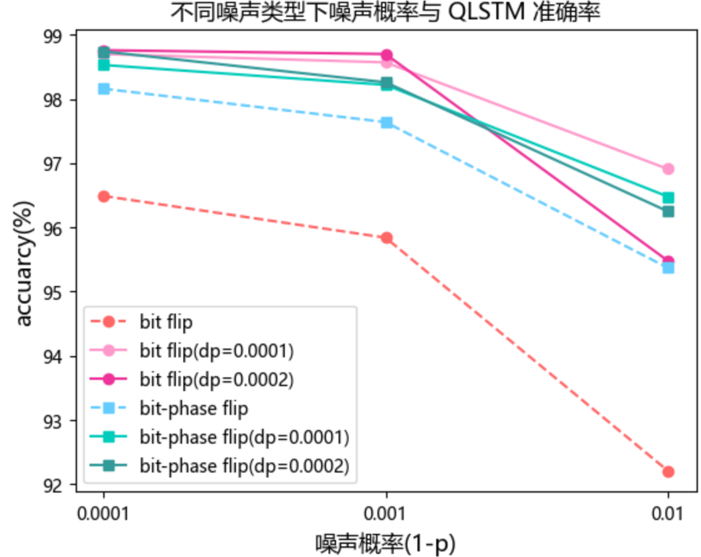
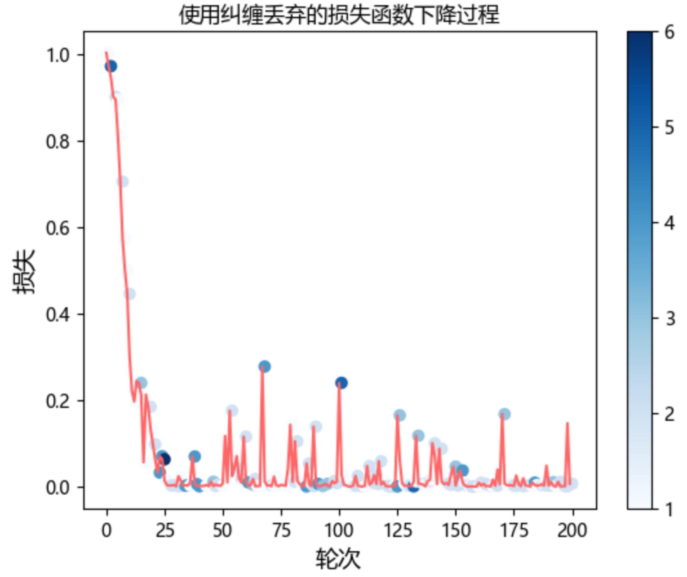

## 4.4 量子噪声鲁棒性提升

如 3.4.4 节的实验结果，在所考虑的三类量子噪声范围内，相位翻转噪声对 QLSTM 模型性能影响有限，然而比特翻转噪声以及比特-相位翻转噪声（尤其是前者）对 QLSTM 模型预测性能有较为明显的影响。本节主要尝试提升 QLSTM 在量子噪声环境下的鲁棒性。考虑经典情境下，正则化方法有助于提升模型的鲁棒性，本节主要尝试使用 4.3 节提出的纠缠丢弃法来优化 QLSTM 模型的量子噪声鲁棒性（如 4.3 节讨论，旋转丢弃法较纠缠丢弃法不稳，此节主要考虑使用纠缠丢弃法）。

首先，主要考虑对 QLSTM 模型性能影响较大的比特翻转噪声与比特-相位翻转噪声，基于不同丢弃概率使用纠缠丢弃法，则在上述两类噪声类型以及不同噪声概率下的实验结果如下表所示。

| 噪声类型      | 噪声概率（1-p） | 丢弃概率（dp） | accuarcy(%) | RMSE    | MSE      | MAE     |
| ------------- | --------------- | -------- | ----------- | ------- | -------- | ------- |
| 比特翻转      | 0.0001          | 0.0001   | 98.70       | 8.9985  | 84.2146  | 6.7310  |
|               |                 | 0.0002   | 98.76       | 8.7367  | 76.4219  | 6.4461  |
|               | 0.001           | 0.0001   | 98.57       | 10.3725 | 108.2638 | 7.4276  |
|               |                 | 0.0002   | 98.70       | 8.6949  | 75.7444  | 6.7242  |
|               | 0.01            | 0.0001   | 96.91       | 20.1946 | 471.0036 | 16.0078 |
|               |                 | 0.0002   | 95.48       | 27.9340 | 931.0365 | 23.4463 |
| 比特-相位翻转 | 0.0001          | 0.0001   | 98.53       | 10.2491 | 111.7891 | 8.1560  |
|               |                 | 0.0002   | 98.74       | 8.6601  | 76.1249  | 6.5204  |
|               | 0.001           | 0.0001   | 98.22       | 11.2144 | 133.9860 | 9.2016  |
|               |                 | 0.0002   | 98.26       | 11.8241 | 162.1645 | 9.0362  |
|               | 0.01            | 0.0001   | 96.48       | 22.0530 | 512.7901 | 18.2340 |
|               |                 | 0.0002   | 96.25       | 22.6053 | 528.1411 | 20.6293 |

图 4.4.1 给出了更直观的表示（图中虚线部分为原来在比特翻转与比特-相位翻转噪声下的实验结果），可见在原量子噪声环境基础上适当采用纠缠丢弃可以明显地提升 QLSTM 模型的预测性能。

<label>图 4.4.1 使用纠缠丢弃后量子噪声下 QLSTM 训练准确率</label>

图 4.4.2 给出了在比特翻转噪声环境下（1-p=0.001）使用纠缠丢弃（dp=0.0002）后的训练结果，其中蓝点部分标记出了纠缠丢弃发生的时刻与相应的次数。可以看到在许多次损失函数上升回弹之后发生的纠缠丢弃可使得损失函数再次下降。

<label>图 4.4.2 使用纠缠丢弃的损失函数下降过程</label>

本节借助使用 4.3 节的纠缠丢弃法，初步验证了其能提升 QLSTM 模型在带量子噪声环境下（尤其是对其训练影响较大的比特翻转与比特-相位翻转噪声）的预测性能。为现有环境下提升量子深度学习对量子噪声环境的鲁棒性提供了一个可能的方法。
